# Personal CLI Tool Generator: Complete Claude Code Mastery Tutorial

> **Build a tool that generates CLI applications from natural language while mastering every Claude Code concept**

---

## 📋 Overview

| Attribute         | Details                                 |
| ----------------- | --------------------------------------- |
| **Timeline**      | 2-3 weeks                               |
| **Difficulty**    | Intermediate                            |
| **Prerequisites** | Python basics, command line familiarity |

---

## 🎯 Why This Project?

Transform natural language descriptions into complete, working CLI tools:

**You describe:**

> "I need a CLI that converts images between formats, with options for quality and resize"

**You get:**

```bash
imgconvert input.png output.jpg --quality 85 --resize 800x600
```

### Pain Points Solved by Claude Code

| Pain Point                                     | Claude Code Solution |
| ---------------------------------------------- | -------------------- |
| Re-explaining CLI preferences every time       | **CLAUDE.md**        |
| Typing repetitive generation prompts           | **Slash Commands**   |
| Forgetting help text or input validation       | **Hooks**            |
| Wanting suggestions while describing features  | **Skills**           |
| Generating tests and implementation separately | **Subagents**        |
| Checking PyPI for name conflicts               | **MCP Tools**        |
| Sharing your generator with others             | **Plugins**          |

---

## 🗺️ Complete Learning Journey


---

## 📚 Table of Contents

### Week 1: Foundation

- [Day 1: Project Setup + Configuration](#day-1-project-setup--configuration)
- [Day 2: Core Models + Generator Engine](#day-2-core-models--generator-engine)
- [Day 3: Your First Slash Commands](#day-3-your-first-slash-commands)
- [Day 4: More Commands + Command Chaining](#day-4-more-commands--command-chaining)
- [Day 5: Quality Hooks](#day-5-quality-hooks)

### Week 2: Intelligence

- [Day 6: Context-Aware Skills](#day-6-context-aware-skills)
- [Day 7: Subagent Coordination](#day-7-subagent-coordination)
- [Day 8: MCP External Tools](#day-8-mcp-external-tools)
- [Day 9: Memory & Context Management](#day-9-memory--context-management)
- [Day 10: Testing & Packaging](#day-10-testing--packaging)

### Week 3: Polish

- [Days 11-12: Documentation + Examples](#days-11-12-documentation--examples)
- [Days 13-14: Final Testing + Release](#days-13-14-final-testing--release)

### Appendices

- [A: Troubleshooting Guide](#appendix-a-troubleshooting-guide)
- [B: Quick Reference Cards](#appendix-b-quick-reference-cards)
- [C: Extension Ideas](#appendix-c-extension-ideas)

---

# Week 1: Foundation

---

## Day 1: Project Setup + Configuration

### 📍 Where You Are


### 🎓 Learning Objectives

- Understand why CLAUDE.md exists
- Create effective project context
- Experience the "cold start" problem

---

### The Cold Start Problem

Open Claude Code in an empty directory and try:

```
Help me create a function that generates a Click command
from a natural language description.
```

**Notice Claude's questions:**

- What Python version?
- Click or Typer or argparse?
- How should the output be structured?
- Where should generated code go?

Now answer them. Close the session. Open a new one. Ask a related question.

> ⚠️ **Claude remembers nothing.** This is the pain CLAUDE.md solves.

---

### Project Setup

```bash
# Create project structure
mkdir cli-generator
cd cli-generator

# Claude Code directories
mkdir -p .claude/{commands,hooks,skills,subagents,mcp,rules,plugins}

# Source code directories
mkdir -p src/cli_generator/{generators,validators,templates}
mkdir -p tests/{unit,integration}
mkdir -p generated  # Where generated CLIs go
mkdir -p examples   # Example CLI descriptions

# Initialize Python project with uv
uv init
uv venv
source .venv/bin/activate  # or `.venv\Scripts\activate` on Windows

# Create initial files
touch src/cli_generator/__init__.py
touch src/cli_generator/cli.py
touch src/cli_generator/models.py
touch src/cli_generator/generators/__init__.py
touch src/cli_generator/validators/__init__.py
touch tests/__init__.py
```

Create `pyproject.toml`:

```toml
[project]
name = "cli-generator"
version = "0.1.0"
description = "Generate CLI tools from natural language descriptions"
requires-python = ">=3.11"
dependencies = [
    "click>=8.1",
    "rich>=13.0",
    "pydantic>=2.0",
    "pydantic-ai>=0.1",
    "jinja2>=3.1",
    "httpx>=0.25",
    "pytest>=7.0",
    "pytest-asyncio>=0.21",
]

[project.scripts]
cli-gen = "cli_generator.cli:main"

[build-system]
requires = ["setuptools>=61.0"]
build-backend = "setuptools.build_meta"

[tool.pytest.ini_options]
asyncio_mode = "auto"
testpaths = ["tests"]
```

Install in development mode:

```bash
uv pip install -e .
```

---

### Creating Your CLAUDE.md

This is the most important file. It tells Claude everything about your project.

Create `.claude/CLAUDE.md`:

````markdown
# CLI Generator

## What This Project Does

Generates complete, working CLI applications from natural language descriptions.

Input: "A CLI that downloads YouTube videos with quality selection"
Output: A complete Python package with Click commands, help text, error handling, and tests.

## Current State

Week 1: Building foundation - core generator working, basic commands.

## Technology Decisions

### Why Click (not Typer or argparse)?

- Most widely used in production
- Excellent documentation
- Decorators are explicit (good for generation)
- Better error messages than argparse

### Why Jinja2 for Templates?

- Industry standard
- Easy to read template syntax
- Good error messages for template issues
- Supports template inheritance

### Why PydanticAI?

- Type-safe LLM interactions
- Structured output parsing
- Built-in retry logic
- Works with multiple providers

## My CLI Preferences (Use These for Generation)

### Structure

- One command per file in `commands/` directory
- Main CLI group in `cli.py`
- Shared utilities in `utils.py`

### Style

- Always include `--help` (Click does this automatically)
- Always include `--version` flag
- Use `--verbose/-v` for debug output
- Use `--quiet/-q` to suppress output
- Color output by default, `--no-color` to disable

### Error Handling

- Catch exceptions and show user-friendly messages
- Exit code 0 for success, 1 for user error, 2 for system error
- Never show stack traces unless `--verbose`

### Documentation

- Every command has a docstring (becomes help text)
- Every option has `help=` parameter
- Include usage examples in command docstrings

## Data Models

### CLISpec

The specification for a CLI to generate:

```python
class CLISpec(BaseModel):
    name: str                    # CLI name (e.g., "imgconvert")
    description: str             # What it does
    commands: list[CommandSpec]  # Commands to generate
    global_options: list[OptionSpec]  # Options for all commands
    python_version: str = "3.11"
    dependencies: list[str] = []
```
````

### CommandSpec

A single command in the CLI:

```python
class CommandSpec(BaseModel):
    name: str                    # Command name (e.g., "convert")
    description: str             # Help text
    arguments: list[ArgumentSpec]
    options: list[OptionSpec]
    examples: list[str] = []
```

### OptionSpec

A command-line option:

```python
class OptionSpec(BaseModel):
    name: str                    # Long name (e.g., "output")
    short: str | None = None     # Short name (e.g., "o")
    type: str = "str"            # str, int, float, bool, path, choice
    required: bool = False
    default: Any = None
    help: str = ""
    choices: list[str] | None = None  # For choice type
```

### ArgumentSpec

A positional argument:

```python
class ArgumentSpec(BaseModel):
    name: str
    type: str = "str"
    required: bool = True
    help: str = ""
```

## File Structure

```
cli-generator/
├── .claude/
│   ├── CLAUDE.md              # This file
│   ├── commands/              # Slash commands
│   ├── hooks/                 # Quality gates
│   ├── skills/                # Context-aware behaviors
│   ├── subagents/             # Specialized agents
│   ├── mcp/                   # External tool definitions
│   └── rules/                 # Standards and guidelines
├── src/cli_generator/
│   ├── __init__.py
│   ├── cli.py                 # Main CLI (our own interface)
│   ├── models.py              # Pydantic models
│   ├── generators/
│   │   ├── __init__.py
│   │   ├── spec_generator.py  # NL → CLISpec
│   │   ├── code_generator.py  # CLISpec → Python code
│   │   └── test_generator.py  # CLISpec → pytest tests
│   ├── validators/
│   │   ├── __init__.py
│   │   ├── spec_validator.py  # Validate CLISpec
│   │   └── code_validator.py  # Validate generated code
│   └── templates/
│       ├── cli.py.j2          # Main CLI template
│       ├── command.py.j2      # Command template
│       └── test.py.j2         # Test template
├── tests/
├── generated/                 # Output directory
└── examples/                  # Example descriptions
```

## Common Workflows

### Generate a New CLI

1. User provides natural language description
2. LLM parses into CLISpec
3. Validator checks spec
4. Code generator creates Python files
5. Test generator creates pytest files
6. Output validator checks code compiles

### Add Command to Existing CLI

1. Load existing CLISpec from generated CLI
2. Parse new command description
3. Merge into existing spec
4. Regenerate code (preserving customizations?)

## What's Not Built Yet

- [ ] Spec generator (Day 2)
- [ ] Code generator (Day 2)
- [ ] Slash commands (Days 3-4)
- [ ] Hooks (Day 5)
- [ ] Skills (Day 6)
- [ ] Subagents (Day 7)
- [ ] MCP tools (Day 8)

## Testing Strategy

- Unit tests: Each generator/validator in isolation
- Integration tests: Full NL → working CLI flow
- Golden tests: Known inputs produce expected outputs

````

---

### Create Rules Files

Create `.claude/rules/code_standards.md`:

```markdown
# Code Standards

## Python Style
- Python 3.11+ features allowed (match statements, type unions with |)
- Type hints required on all function signatures
- Docstrings required on all public functions
- Use `pathlib.Path` for file paths
- Use `async/await` for I/O operations

## Generated Code Style
Generated CLIs should follow these conventions:
- Imports at top, stdlib first, then third-party, then local
- One class per file for complex commands
- Helper functions prefixed with underscore
- Constants in UPPER_SNAKE_CASE

## Testing
- Every generator function needs tests
- Use pytest fixtures for common test data
- Mock LLM calls in unit tests
- Integration tests can use real LLM (marked slow)

## Error Messages
- User-facing: Friendly, actionable
- Developer-facing: Include context (what was being generated)
- Never expose internal details to users
````

Create `.claude/rules/generation_rules.md`:

```markdown
# CLI Generation Rules

## Naming Conventions

- CLI names: lowercase, hyphens allowed (e.g., `my-tool`)
- Command names: lowercase, underscores for multi-word (e.g., `list_items`)
- Option names: lowercase, hyphens (e.g., `--output-dir`)
- Short options: single letter, common conventions (e.g., `-o` for output, `-v` for verbose)

## Required Elements

Every generated CLI must have:

1. `--help` flag (Click provides automatically)
2. `--version` flag
3. Proper exit codes (0=success, 1=user error, 2=system error)
4. Error handling that doesn't show tracebacks

## Forbidden Patterns

- Never generate `eval()` or `exec()`
- Never generate hardcoded credentials
- Never generate commands that delete without confirmation
- Never generate `sudo` or privilege escalation

## Template Variables

Templates receive these variables:

- `cli`: The full CLISpec object
- `command`: The current CommandSpec (in command template)
- `timestamp`: Generation timestamp
- `generator_version`: Version of cli-generator
```

---

### Test Your CLAUDE.md

Start a fresh Claude Code session in your project directory. Ask:

```
Based on this project, create the CLISpec Pydantic model.
```

Claude should:

- ✅ Know you're using Pydantic v2
- ✅ Know the field structure from CLAUDE.md
- ✅ Follow your code standards

> 💡 **If Claude asks questions already answered in CLAUDE.md, update CLAUDE.md with clearer answers.**

---

### Settings & Permissions

Beyond CLAUDE.md, Claude Code uses `settings.json` files to control behavior and permissions.

#### Settings File Locations

| File | Scope | Use Case |
|------|-------|----------|
| `~/.claude/settings.json` | User-level | Personal preferences across all projects |
| `.claude/settings.json` | Project-level | Team-shared project settings |
| `.claude/settings.local.json` | Local-only | Personal overrides (not committed) |

**Settings Hierarchy:** Enterprise → User → Project → Local (later files override earlier ones)

#### Permissions Configuration

Control what Claude can do automatically:

```json
{
  "permissions": {
    "allow": [
      "Read(**)",
      "Write(./src/**)",
      "Write(./tests/**)",
      "Bash(npm:*)",
      "Bash(git:*)",
      "Bash(pytest:*)"
    ],
    "deny": [
      "Read(.env*)",
      "Write(*.secret)",
      "Bash(rm -rf:*)",
      "Bash(sudo:*)"
    ]
  }
}
```

**Permission Patterns:**
- `ToolName` - Allow all uses of tool
- `ToolName(*)` - Allow with any argument
- `ToolName(pattern)` - Allow matching calls only (supports globs)

**Deny rules override allow rules.** Claude walks the list from first to last.

#### Create Project Settings

Create `.claude/settings.json`:

```json
{
  "permissions": {
    "allow": [
      "Read(**)",
      "Write(./src/**)",
      "Write(./tests/**)",
      "Write(./generated/**)",
      "Bash(uv:*)",
      "Bash(pytest:*)",
      "Bash(git status)",
      "Bash(git diff:*)",
      "Bash(git add:*)",
      "Bash(git commit:*)"
    ],
    "deny": [
      "Bash(rm -rf:*)",
      "Bash(sudo:*)",
      "Write(.env*)"
    ]
  }
}
```

> 💡 **Use `/permissions` command** to interactively add or remove tool permissions.

---

### Status Line Configuration

The status line displays contextual information at the bottom of Claude Code.

#### Quick Setup

Use the `/statusline` command:

```
/statusline show model name and token usage
```

#### Manual Configuration

Add to your settings.json:

```json
{
  "statusLine": {
    "type": "command",
    "command": "~/.claude/statusline.sh"
  }
}
```

Create `~/.claude/statusline.sh`:

```bash
#!/bin/bash
# Read JSON from stdin, output formatted status

read -r json
model=$(echo "$json" | jq -r '.model // "unknown"')
tokens=$(echo "$json" | jq -r '.contextTokens // 0')
max=$(echo "$json" | jq -r '.maxTokens // 200000')
percent=$((tokens * 100 / max))

echo "🤖 $model | 📊 ${percent}% context"
```

Make it executable:

```bash
chmod +x ~/.claude/statusline.sh
```

#### Third-Party Status Lines

For more advanced status lines:

```bash
# ccstatusline - Beautiful powerline themes
npx ccstatusline@latest

# ccusage - Cost tracking
pip install ccusage
```

---

### ✅ Day 1 Checklist

- [ ] Project structure created
- [ ] Dependencies installed with uv
- [ ] CLAUDE.md comprehensive and tested
- [ ] Rules files created
- [ ] Project settings.json with permissions configured
- [ ] Status line configured (optional but recommended)
- [ ] Fresh Claude session reads context correctly

### 📝 Exercise: CLAUDE.md Stress Test

Try these prompts in a fresh session:

1. "What CLI framework are we using and why?"
2. "Show me the data model for a command option."
3. "Where should generated test files go?"
4. "What's our convention for short option flags?"

**All answers should come from CLAUDE.md without additional questions.**

---

## Day 2: Core Models + Generator Engine

### 📍 Where You Are

```mermaid
flowchart LR
    subgraph Week1["Week 1: Foundation"]
        D1["✅ Day 1<br/>Configuration"]
        D2["📍 Day 2<br/>Models"]
        D3["Day 3<br/>Commands"]
        D4["Day 4<br/>Chaining"]
        D5["Day 5<br/>Hooks"]
        D1 --> D2 --> D3 --> D4 --> D5
    end

    style D1 fill:#9e9e9e,color:#fff
    style D2 fill:#4caf50,color:#fff
```

### 🎓 Learning Objectives

- Build the core generation engine through iterative prompting
- Experience the TDD workflow with Claude Code
- Understand how to verify and correct Claude's output

### Your Role Today

**You will:**

1. Write prompts to Claude Code
2. Review the generated code against requirements
3. Run tests to verify correctness
4. Iterate when something needs adjustment

**Claude will:**

1. Generate code based on your prompts and CLAUDE.md context
2. Follow the patterns and standards you've established
3. Correct itself when you point out issues

---

### Step 1: Create the Data Models

#### The Prompt

Open Claude Code in your `cli-generator` project directory and type:

```
Based on the data models defined in CLAUDE.md, create src/cli_generator/models.py with:

1. OptionSpec - command line option
2. ArgumentSpec - positional argument
3. CommandSpec - a CLI command
4. CLISpec - complete CLI specification

Include Pydantic validators for:
- CLI name must be valid Python package name (lowercase, hyphens allowed)
- Option short names must be single character
- No duplicate command names in a CLI
- No duplicate option names within a command
- Choice type options must have choices list

Write tests first in tests/unit/test_models.py following TDD.
```

#### What to Expect

Claude should generate:

1. **Test file first** (`tests/unit/test_models.py`) with tests for:

   - Valid option creation
   - Short option validation (single character only)
   - Choice type requiring choices list
   - Valid CLI names
   - Invalid CLI names (uppercase, special characters)
   - Duplicate command detection
   - Duplicate option detection

2. **Implementation file** (`src/cli_generator/models.py`) with:
   - Pydantic BaseModel classes
   - Field validators using `@field_validator`
   - Model validators using `@model_validator`
   - Proper type hints

---

#### Reference: Expected Test Structure

Your tests should cover cases like these:

```python
"""Tests for CLI specification models."""

import pytest
from pydantic import ValidationError
from cli_generator.models import OptionSpec, ArgumentSpec, CommandSpec, CLISpec


class TestOptionSpec:
    """Tests for OptionSpec model."""

    def test_valid_option_with_short(self):
        """Valid option with short name."""
        opt = OptionSpec(name="output", short="o", type="str", help="Output file")
        assert opt.name == "output"
        assert opt.short == "o"

    def test_valid_option_without_short(self):
        """Valid option without short name."""
        opt = OptionSpec(name="verbose", type="bool", help="Verbose output")
        assert opt.short is None

    def test_short_must_be_single_character(self):
        """Short option must be exactly one letter."""
        with pytest.raises(ValidationError) as exc_info:
            OptionSpec(name="output", short="out", type="str")
        assert "single letter" in str(exc_info.value).lower()

    def test_short_converted_to_lowercase(self):
        """Short option is normalized to lowercase."""
        opt = OptionSpec(name="verbose", short="V", type="bool")
        assert opt.short == "v"

    def test_choice_type_requires_choices(self):
        """Choice type must have choices list."""
        with pytest.raises(ValidationError) as exc_info:
            OptionSpec(name="format", type="choice", help="Output format")
        assert "choices" in str(exc_info.value).lower()

    def test_choice_type_with_choices(self):
        """Choice type with valid choices list."""
        opt = OptionSpec(
            name="format",
            type="choice",
            choices=["json", "yaml", "xml"]
        )
        assert opt.choices == ["json", "yaml", "xml"]

    def test_non_choice_type_rejects_choices(self):
        """Non-choice types should not have choices."""
        with pytest.raises(ValidationError):
            OptionSpec(name="count", type="int", choices=["1", "2", "3"])


class TestArgumentSpec:
    """Tests for ArgumentSpec model."""

    def test_valid_argument(self):
        """Valid argument creation."""
        arg = ArgumentSpec(name="input_file", type="path", help="Input file")
        assert arg.name == "input_file"
        assert arg.required is True  # Default

    def test_argument_name_validation(self):
        """Argument names must be lowercase with underscores."""
        with pytest.raises(ValidationError):
            ArgumentSpec(name="inputFile", type="str")  # camelCase not allowed


class TestCommandSpec:
    """Tests for CommandSpec model."""

    def test_valid_command(self):
        """Valid command creation."""
        cmd = CommandSpec(
            name="convert",
            description="Convert files between formats",
            arguments=[ArgumentSpec(name="input", type="path")],
            options=[OptionSpec(name="output", short="o", type="path")]
        )
        assert cmd.name == "convert"
        assert len(cmd.arguments) == 1
        assert len(cmd.options) == 1

    def test_no_duplicate_option_names(self):
        """Command cannot have duplicate option names."""
        with pytest.raises(ValidationError) as exc_info:
            CommandSpec(
                name="convert",
                description="Convert files",
                options=[
                    OptionSpec(name="output", type="path"),
                    OptionSpec(name="output", type="str"),  # Duplicate!
                ]
            )
        assert "duplicate" in str(exc_info.value).lower()

    def test_no_duplicate_short_options(self):
        """Command cannot have duplicate short options."""
        with pytest.raises(ValidationError) as exc_info:
            CommandSpec(
                name="convert",
                description="Convert files",
                options=[
                    OptionSpec(name="output", short="o", type="path"),
                    OptionSpec(name="overwrite", short="o", type="bool"),  # Duplicate!
                ]
            )
        assert "duplicate" in str(exc_info.value).lower()


class TestCLISpec:
    """Tests for CLISpec model."""

    def test_valid_cli_spec(self):
        """Valid CLI specification."""
        spec = CLISpec(
            name="my-tool",
            description="A useful tool",
            commands=[
                CommandSpec(name="run", description="Run the tool")
            ]
        )
        assert spec.name == "my-tool"
        assert spec.version == "0.1.0"  # Default

    def test_cli_name_must_be_lowercase(self):
        """CLI name must be lowercase."""
        with pytest.raises(ValidationError) as exc_info:
            CLISpec(name="MyTool", description="A tool")
        assert "package name" in str(exc_info.value).lower()

    def test_cli_name_allows_hyphens(self):
        """CLI name can contain hyphens."""
        spec = CLISpec(name="my-awesome-tool", description="A tool")
        assert spec.name == "my-awesome-tool"

    def test_cli_name_rejects_special_chars(self):
        """CLI name cannot have special characters."""
        with pytest.raises(ValidationError):
            CLISpec(name="my_tool!", description="A tool")

    def test_no_duplicate_commands(self):
        """CLI cannot have duplicate command names."""
        with pytest.raises(ValidationError) as exc_info:
            CLISpec(
                name="my-tool",
                description="A tool",
                commands=[
                    CommandSpec(name="list", description="List items"),
                    CommandSpec(name="list", description="List things"),  # Duplicate!
                ]
            )
        assert "duplicate" in str(exc_info.value).lower()

    def test_get_all_dependencies_includes_click(self):
        """Dependencies always include Click."""
        spec = CLISpec(
            name="my-tool",
            description="A tool",
            dependencies=["requests", "rich"]
        )
        deps = spec.get_all_dependencies()
        assert "click>=8.1" in deps
        assert "requests" in deps
        assert "rich" in deps
```

---

#### Reference: Expected Model Implementation

Your implementation should follow this pattern:

```python
"""Data models for CLI specification and generation."""

from typing import Any, Literal
from pydantic import BaseModel, Field, field_validator, model_validator
import re


class OptionSpec(BaseModel):
    """Specification for a command-line option."""

    name: str = Field(..., description="Long option name without dashes")
    short: str | None = Field(None, description="Single-character short name")
    type: Literal["str", "int", "float", "bool", "path", "choice"] = "str"
    required: bool = False
    default: Any = None
    help: str = ""
    choices: list[str] | None = None

    @field_validator("name")
    @classmethod
    def validate_name(cls, v: str) -> str:
        """Option names must be lowercase with hyphens."""
        if not re.match(r"^[a-z][a-z0-9-]*$", v):
            raise ValueError(f"Option name must be lowercase with hyphens: {v}")
        return v

    @field_validator("short")
    @classmethod
    def validate_short(cls, v: str | None) -> str | None:
        """Short option must be a single letter."""
        if v is not None:
            if len(v) != 1 or not v.isalpha():
                raise ValueError(f"Short option must be single letter: {v}")
            return v.lower()
        return v

    @model_validator(mode="after")
    def validate_choices(self) -> "OptionSpec":
        """Validate choice type has choices, and vice versa."""
        if self.type == "choice" and not self.choices:
            raise ValueError("Choice type requires choices list")
        if self.choices and self.type != "choice":
            raise ValueError("Choices only valid for choice type")
        return self


class ArgumentSpec(BaseModel):
    """Specification for a positional argument."""

    name: str = Field(..., description="Argument name")
    type: Literal["str", "int", "float", "path"] = "str"
    required: bool = True
    help: str = ""

    @field_validator("name")
    @classmethod
    def validate_name(cls, v: str) -> str:
        """Argument names must be lowercase with underscores."""
        if not re.match(r"^[a-z][a-z0-9_]*$", v):
            raise ValueError(f"Argument name must be lowercase with underscores: {v}")
        return v


class CommandSpec(BaseModel):
    """Specification for a CLI command."""

    name: str = Field(..., description="Command name")
    description: str = Field(..., description="Help text for command")
    arguments: list[ArgumentSpec] = Field(default_factory=list)
    options: list[OptionSpec] = Field(default_factory=list)
    examples: list[str] = Field(default_factory=list)

    @field_validator("name")
    @classmethod
    def validate_name(cls, v: str) -> str:
        """Command names must be lowercase with underscores."""
        if not re.match(r"^[a-z][a-z0-9_]*$", v):
            raise ValueError(f"Command name must be lowercase with underscores: {v}")
        return v

    @model_validator(mode="after")
    def validate_no_duplicate_options(self) -> "CommandSpec":
        """Check for duplicate option names and short options."""
        names = [opt.name for opt in self.options]
        if len(names) != len(set(names)):
            duplicates = [n for n in names if names.count(n) > 1]
            raise ValueError(f"Duplicate option names in command: {set(duplicates)}")

        shorts = [opt.short for opt in self.options if opt.short]
        if len(shorts) != len(set(shorts)):
            duplicates = [s for s in shorts if shorts.count(s) > 1]
            raise ValueError(f"Duplicate short option names in command: {set(duplicates)}")

        return self


class CLISpec(BaseModel):
    """Complete specification for a CLI application."""

    name: str = Field(..., description="CLI package/command name")
    description: str = Field(..., description="What the CLI does")
    commands: list[CommandSpec] = Field(default_factory=list)
    global_options: list[OptionSpec] = Field(default_factory=list)
    python_version: str = "3.11"
    dependencies: list[str] = Field(default_factory=list)
    author: str | None = None
    version: str = "0.1.0"

    @field_validator("name")
    @classmethod
    def validate_name(cls, v: str) -> str:
        """CLI name must be a valid Python package name."""
        if not re.match(r"^[a-z][a-z0-9-]*$", v):
            raise ValueError(f"CLI name must be valid package name (lowercase, hyphens ok): {v}")
        return v

    @model_validator(mode="after")
    def validate_no_duplicate_commands(self) -> "CLISpec":
        """Check for duplicate command names."""
        names = [cmd.name for cmd in self.commands]
        if len(names) != len(set(names)):
            duplicates = [n for n in names if names.count(n) > 1]
            raise ValueError(f"Duplicate command names: {set(duplicates)}")
        return self

    def get_all_dependencies(self) -> list[str]:
        """Get all dependencies including Click."""
        deps = ["click>=8.1"]
        deps.extend(self.dependencies)
        return list(set(deps))
```

---

#### Verify Your Output

```bash
# Run the tests
uv run pytest tests/unit/test_models.py -v

# Expected: All tests pass
```

**If tests fail**, tell Claude what went wrong:

```
The test test_short_must_be_single_character is failing. The validator
is accepting "out" as a valid short option. The regex should ensure
exactly one character.
```

---

### Step 2: Create the Spec Generator

#### The Prompt

```
Create src/cli_generator/generators/spec_generator.py that uses PydanticAI
to convert natural language descriptions into CLISpec objects.

Requirements:
1. SpecGenerator class with model parameter (default: "openai:gpt-4o-mini")
2. System prompt that knows CLI best practices from CLAUDE.md
3. async generate(description: str) -> CLISpec method
4. async add_command(spec: CLISpec, description: str) -> CLISpec method

The system prompt should guide the LLM to:
- Create appropriate CLI names from descriptions
- Break complex tools into multiple commands
- Use standard option conventions (-o for output, -v for verbose, etc.)
- Include helpful descriptions and examples

Write tests in tests/unit/test_spec_generator.py that mock LLM responses.
```

#### What to Expect

Claude should generate:

1. **Test file** with mocked LLM responses
2. **Implementation** using PydanticAI's Agent class

---

#### Reference: Expected Test Structure

```python
"""Tests for spec generator."""

import pytest
from unittest.mock import AsyncMock, patch
from cli_generator.generators.spec_generator import SpecGenerator
from cli_generator.models import CLISpec, CommandSpec, OptionSpec


class TestSpecGenerator:
    """Tests for SpecGenerator."""

    @pytest.fixture
    def generator(self):
        """Create a SpecGenerator instance."""
        return SpecGenerator()

    @pytest.mark.asyncio
    async def test_generate_returns_cli_spec(self, generator):
        """Generate should return a valid CLISpec."""
        # Mock the PydanticAI agent
        mock_spec = CLISpec(
            name="word-counter",
            description="Count words in files",
            commands=[
                CommandSpec(
                    name="count",
                    description="Count words in a file",
                    options=[
                        OptionSpec(name="lines", short="l", type="bool", help="Count lines")
                    ]
                )
            ]
        )

        with patch.object(generator.agent, 'run', new_callable=AsyncMock) as mock_run:
            mock_run.return_value.data = mock_spec

            result = await generator.generate("A tool to count words in files")

            assert isinstance(result, CLISpec)
            assert result.name == "word-counter"
            assert len(result.commands) == 1

    @pytest.mark.asyncio
    async def test_add_command_extends_spec(self, generator):
        """add_command should add to existing spec."""
        existing_spec = CLISpec(
            name="file-tool",
            description="File utilities",
            commands=[
                CommandSpec(name="read", description="Read a file")
            ]
        )

        extended_spec = CLISpec(
            name="file-tool",
            description="File utilities",
            commands=[
                CommandSpec(name="read", description="Read a file"),
                CommandSpec(name="write", description="Write to a file")
            ]
        )

        with patch.object(generator.agent, 'run', new_callable=AsyncMock) as mock_run:
            mock_run.return_value.data = extended_spec

            result = await generator.add_command(existing_spec, "Add a write command")

            assert len(result.commands) == 2
            assert result.commands[1].name == "write"

    def test_system_prompt_includes_conventions(self, generator):
        """System prompt should mention CLI conventions."""
        prompt = generator._system_prompt()

        assert "verbose" in prompt.lower() or "-v" in prompt
        assert "output" in prompt.lower() or "-o" in prompt
        assert "click" in prompt.lower() or "CLI" in prompt
```

---

#### Reference: Expected Implementation

```python
"""Generate CLISpec from natural language descriptions."""

from pydantic_ai import Agent
from ..models import CLISpec


class SpecGenerator:
    """Generates CLI specifications from natural language."""

    def __init__(self, model: str = "openai:gpt-4o-mini"):
        """Initialize with specified LLM model."""
        self.agent = Agent(
            model,
            result_type=CLISpec,
            system_prompt=self._system_prompt()
        )

    def _system_prompt(self) -> str:
        """System prompt encoding CLI design best practices."""
        return """You are an expert CLI designer. Convert natural language
descriptions into structured CLI specifications.

Follow these guidelines:

## Naming
- CLI names: lowercase, hyphens allowed (e.g., my-tool, file-converter)
- Command names: lowercase, underscores for multi-word (e.g., list_all)
- Option names: lowercase, hyphens (e.g., --output-dir)

## Standard Options
Use conventional short options:
- -o / --output: Output file or directory
- -v / --verbose: Verbose/debug output
- -q / --quiet: Suppress output
- -f / --force: Force operation without confirmation
- -n / --dry-run: Show what would happen
- -r / --recursive: Process recursively

## Structure
- Simple tools: Single command (the CLI name IS the command)
- Complex tools: Multiple subcommands under a group
- Required inputs: Use arguments (positional)
- Optional inputs: Use options (--flag)

## Best Practices
- Every command needs a clear description
- Include realistic usage examples
- Add helpful default values where sensible
- Use 'path' type for file/directory inputs
- Use 'choice' type for fixed sets of values
- Use 'bool' type for on/off flags

## Output Format
Return a complete CLISpec with all fields populated appropriately.
Infer sensible values for anything not explicitly mentioned."""

    async def generate(self, description: str) -> CLISpec:
        """Generate a CLISpec from a natural language description.

        Args:
            description: Natural language description of desired CLI

        Returns:
            Complete CLISpec ready for code generation
        """
        result = await self.agent.run(description)
        return result.data

    async def add_command(self, spec: CLISpec, command_description: str) -> CLISpec:
        """Add a new command to an existing CLI spec.

        Args:
            spec: Existing CLISpec to extend
            command_description: Description of command to add

        Returns:
            Updated CLISpec with new command
        """
        prompt = f"""Existing CLI: {spec.name}
Description: {spec.description}
Current commands: {[cmd.name for cmd in spec.commands]}

Add this new command: {command_description}

Return the complete updated CLISpec with the new command added.
Keep all existing commands unchanged."""

        result = await self.agent.run(prompt)
        return result.data
```

---

#### Verify Your Output

```bash
uv run pytest tests/unit/test_spec_generator.py -v
```

---

### Step 3: Create the Code Generator

#### The Prompt

```
Create the code generator that transforms CLISpec into Python/Click code.

Files to create:

1. src/cli_generator/templates/cli.py.j2 - Jinja2 template for CLI code
   - Should generate valid Click CLI with all commands
   - Include proper decorators for arguments and options
   - Handle all option types (str, int, float, bool, path, choice)
   - Generate docstrings from descriptions
   - Include examples in docstrings

2. src/cli_generator/generators/code_generator.py - CodeGenerator class
   - generate(spec: CLISpec, output_dir: Path) -> dict[str, Path]
   - Creates: cli.py, __init__.py, pyproject.toml, README.md
   - Uses Jinja2 for templating
   - Returns dict mapping file type to path

3. tests/unit/test_code_generator.py
   - Test that generated code compiles (valid Python syntax)
   - Test that all commands are present
   - Test that options have correct types
```

#### What to Expect

This is a larger generation. Claude should create:

1. **Jinja2 template** with Click decorators
2. **CodeGenerator class** using Jinja2 Environment
3. **Helper methods** for rendering pyproject.toml and README
4. **Tests** that verify compilation and structure

---

#### Reference: Expected Template Structure

Create `src/cli_generator/templates/cli.py.j2`:

```jinja2
#!/usr/bin/env python3
"""{{ cli.description }}

Generated by cli-generator v{{ generator_version }}
"""

import click

import {{ dep.split('[')[0].split('>')[0].split('=')[0] }}


__version__ = "{{ cli.version }}"


@click.group()
@click.version_option(__version__)

@click.option(
    "--{{ opt.name }}", "-{{ opt.short }}",
    is_flag=True,
    type=click.Choice({{ opt.choices | tojson }}),
    type=click.Path(),
    type=int,
    type=float,
    default={{ opt.default | tojson }},
    required=True,
    help="{{ opt.help }}"
)

@click.pass_context
def cli(ctx, {{ opt.name | replace("-", "_") }}):
    """{{ cli.description }}"""
    ctx.ensure_object(dict)
    
    ctx.obj["{{ opt.name | replace("-", "_") }}"] = {{ opt.name | replace("-", "_") }}
    



@cli.command()

@click.argument("{{ arg.name }}", type=click.Path(exists=True))


@click.option(
    "--{{ opt.name }}", "-{{ opt.short }}",
    is_flag=True,
    type=click.Choice({{ opt.choices | tojson }}),
    type=click.Path(),
    type=int,
    type=float,
    default={{ opt.default | tojson }},
    required=True,
    help="{{ opt.help }}"
)

@click.pass_context
def {{ command.name }}(ctx, {{ arg.name }}, {{ opt.name | replace("-", "_") }}):
    """{{ command.description }}
    

    Examples:
    
        {{ example }}
    
    
    """
    # TODO: Implement {{ command.name }}
    click.echo(f"Running {{ command.name }}...")



def main():
    """Entry point."""
    cli()


if __name__ == "__main__":
    main()
```

---

#### Reference: Expected CodeGenerator Implementation

````python
"""Generate Python code from CLISpec."""

from pathlib import Path
from datetime import datetime
from jinja2 import Environment, PackageLoader, select_autoescape

from ..models import CLISpec


class CodeGenerator:
    """Generates Python CLI code from specifications."""

    VERSION = "0.1.0"

    def __init__(self):
        """Initialize Jinja2 environment."""
        self.env = Environment(
            loader=PackageLoader("cli_generator", "templates"),
            autoescape=select_autoescape(),
            trim_blocks=True,
            lstrip_blocks=True
        )

    def generate(self, spec: CLISpec, output_dir: Path) -> dict[str, Path]:
        """Generate complete CLI package.

        Args:
            spec: CLI specification
            output_dir: Where to create the package

        Returns:
            Dict mapping file type to generated path
        """
        output_dir = Path(output_dir)
        package_name = spec.name.replace("-", "_")
        package_dir = output_dir / package_name
        package_dir.mkdir(parents=True, exist_ok=True)

        generated = {}

        # Generate main CLI file
        cli_content = self._render_cli(spec)
        cli_path = package_dir / "cli.py"
        cli_path.write_text(cli_content)
        generated["cli"] = cli_path

        # Generate __init__.py
        init_content = self._render_init(spec)
        init_path = package_dir / "__init__.py"
        init_path.write_text(init_content)
        generated["init"] = init_path

        # Generate pyproject.toml
        pyproject_content = self._render_pyproject(spec)
        pyproject_path = output_dir / "pyproject.toml"
        pyproject_path.write_text(pyproject_content)
        generated["pyproject"] = pyproject_path

        # Generate README.md
        readme_content = self._render_readme(spec)
        readme_path = output_dir / "README.md"
        readme_path.write_text(readme_content)
        generated["readme"] = readme_path

        return generated

    def _render_cli(self, spec: CLISpec) -> str:
        """Render the main CLI file."""
        template = self.env.get_template("cli.py.j2")
        return template.render(
            cli=spec,
            generator_version=self.VERSION,
            timestamp=datetime.now().isoformat()
        )

    def _render_init(self, spec: CLISpec) -> str:
        """Render __init__.py."""
        return f'"""{spec.description}"""\n\n__version__ = "{spec.version}"\n'

    def _render_pyproject(self, spec: CLISpec) -> str:
        """Render pyproject.toml."""
        package_name = spec.name.replace("-", "_")
        deps = spec.get_all_dependencies()
        deps_str = ",\n    ".join(f'"{d}"' for d in deps)

        author_line = ""
        if spec.author:
            author_line = f'\nauthors = [{{name = "{spec.author}"}}]'

        return f'''[project]
name = "{spec.name}"
version = "{spec.version}"
description = "{spec.description}"
requires-python = ">={spec.python_version}"
dependencies = [
    {deps_str}
]{author_line}

[project.scripts]
{spec.name} = "{package_name}.cli:main"

[build-system]
requires = ["setuptools>=61.0"]
build-backend = "setuptools.build_meta"
'''

    def _render_readme(self, spec: CLISpec) -> str:
        """Render README.md."""
        commands_doc = ""
        for cmd in spec.commands:
            commands_doc += f"\n### `{spec.name} {cmd.name}`\n\n"
            commands_doc += f"{cmd.description}\n"
            if cmd.examples:
                commands_doc += "\n**Examples:**\n```bash\n"
                commands_doc += "\n".join(cmd.examples)
                commands_doc += "\n```\n"

        return f'''# {spec.name}

{spec.description}

## Installation

```bash
pip install {spec.name}
````

## Usage

```bash
{spec.name} --help
```

## Commands

{commands_doc}
'''

````

---

#### Reference: Expected Test Structure

```python
"""Tests for code generator."""

import pytest
from pathlib import Path
import ast

from cli_generator.models import CLISpec, CommandSpec, OptionSpec, ArgumentSpec
from cli_generator.generators.code_generator import CodeGenerator


class TestCodeGenerator:
    """Tests for CodeGenerator."""

    @pytest.fixture
    def generator(self):
        """Create a CodeGenerator instance."""
        return CodeGenerator()

    @pytest.fixture
    def sample_spec(self):
        """Create a sample CLISpec for testing."""
        return CLISpec(
            name="test-cli",
            description="A test CLI",
            commands=[
                CommandSpec(
                    name="greet",
                    description="Greet someone",
                    arguments=[
                        ArgumentSpec(name="name", type="str", help="Name to greet")
                    ],
                    options=[
                        OptionSpec(name="loud", short="l", type="bool", help="Shout")
                    ],
                    examples=["test-cli greet World", "test-cli greet World -l"]
                )
            ]
        )

    def test_generate_creates_files(self, generator, sample_spec, tmp_path):
        """Generate should create all expected files."""
        files = generator.generate(sample_spec, tmp_path)

        assert "cli" in files
        assert "init" in files
        assert "pyproject" in files
        assert "readme" in files

        for path in files.values():
            assert path.exists()

    def test_generated_cli_is_valid_python(self, generator, sample_spec, tmp_path):
        """Generated CLI should be valid Python syntax."""
        files = generator.generate(sample_spec, tmp_path)

        cli_content = files["cli"].read_text()

        # This will raise SyntaxError if invalid
        ast.parse(cli_content)

    def test_generated_cli_contains_commands(self, generator, sample_spec, tmp_path):
        """Generated CLI should contain all commands."""
        files = generator.generate(sample_spec, tmp_path)

        cli_content = files["cli"].read_text()

        assert "def greet(" in cli_content
        assert "@cli.command()" in cli_content

    def test_generated_cli_contains_options(self, generator, sample_spec, tmp_path):
        """Generated CLI should contain all options."""
        files = generator.generate(sample_spec, tmp_path)

        cli_content = files["cli"].read_text()

        assert "--loud" in cli_content
        assert '"-l"' in cli_content
        assert "is_flag=True" in cli_content

    def test_pyproject_contains_entry_point(self, generator, sample_spec, tmp_path):
        """pyproject.toml should contain correct entry point."""
        files = generator.generate(sample_spec, tmp_path)

        pyproject_content = files["pyproject"].read_text()

        assert "test-cli" in pyproject_content
        assert "test_cli.cli:main" in pyproject_content

    def test_readme_documents_commands(self, generator, sample_spec, tmp_path):
        """README should document all commands."""
        files = generator.generate(sample_spec, tmp_path)

        readme_content = files["readme"].read_text()

        assert "greet" in readme_content
        assert "Greet someone" in readme_content
````

---

#### Verify Your Output

```bash
uv run pytest tests/unit/test_code_generator.py -v
```

---

### Step 4: Create the CLI Interface

#### The Prompt

```
Create src/cli_generator/cli.py - our CLI interface for the generator.

Commands needed:
1. cli-gen spec <description>
   - Generate and display CLISpec from description
   - Pretty print as JSON with syntax highlighting
   - Don't save any files

2. cli-gen generate <description>
   - Generate complete CLI from description
   - Options: --output/-o for output directory (default: ./generated)
   - Options: --dry-run to show spec without generating
   - Show summary of generated files

3. cli-gen build <spec_file>
   - Build CLI from a saved JSON spec file
   - Options: --output/-o for output directory

Use Rich for colored output and syntax highlighting.
Include proper error handling with user-friendly messages.
```

---

#### Reference: Expected CLI Implementation

```python
"""CLI Generator - Generate CLI tools from natural language."""

import asyncio
import json
from pathlib import Path

import click
from rich.console import Console
from rich.syntax import Syntax
from rich.panel import Panel

from .generators.spec_generator import SpecGenerator
from .generators.code_generator import CodeGenerator
from .models import CLISpec

console = Console()


@click.group()
@click.version_option("0.1.0")
def main():
    """Generate CLI tools from natural language descriptions."""
    pass


@main.command()
@click.argument("description")
def spec(description: str):
    """Generate and display a CLI specification.

    DESCRIPTION is a natural language description of the CLI you want.

    Example:
        cli-gen spec "A tool to resize images"
    """
    console.print("[bold blue]Generating specification...[/bold blue]\n")

    try:
        generator = SpecGenerator()
        cli_spec = asyncio.run(generator.generate(description))

        # Display as syntax-highlighted JSON
        json_output = cli_spec.model_dump_json(indent=2)
        syntax = Syntax(json_output, "json", theme="monokai", line_numbers=True)

        console.print(Panel(syntax, title="Generated CLISpec", border_style="green"))

    except Exception as e:
        console.print(f"[bold red]Error:[/bold red] {e}")
        raise SystemExit(1)


@main.command()
@click.argument("description")
@click.option("-o", "--output", type=click.Path(), default="./generated",
              help="Output directory for generated CLI")
@click.option("--dry-run", is_flag=True,
              help="Show specification without generating files")
def generate(description: str, output: str, dry_run: bool):
    """Generate a complete CLI from a description.

    DESCRIPTION is a natural language description of the CLI you want.

    Example:
        cli-gen generate "A tool to compress images" -o ./my-cli
    """
    console.print("[bold blue]Generating CLI...[/bold blue]\n")

    try:
        # Generate spec
        spec_gen = SpecGenerator()
        cli_spec = asyncio.run(spec_gen.generate(description))

        # Show the spec
        console.print(Panel(
            cli_spec.model_dump_json(indent=2),
            title=f"Specification: {cli_spec.name}",
            border_style="blue"
        ))

        if dry_run:
            console.print("\n[yellow]Dry run - no files generated[/yellow]")
            return

        # Generate code
        code_gen = CodeGenerator()
        output_path = Path(output)
        files = code_gen.generate(cli_spec, output_path)

        # Report results
        console.print(f"\n[bold green]Generated {len(files)} files:[/bold green]")
        for file_type, path in files.items():
            console.print(f"  • {path}")

        console.print(f"\n[bold]Next steps:[/bold]")
        console.print(f"  cd {output_path / cli_spec.name.replace('-', '_')}")
        console.print(f"  uv pip install -e ..")
        console.print(f"  {cli_spec.name} --help")

    except Exception as e:
        console.print(f"[bold red]Error:[/bold red] {e}")
        raise SystemExit(1)


@main.command()
@click.argument("spec_file", type=click.Path(exists=True))
@click.option("-o", "--output", type=click.Path(), default="./generated",
              help="Output directory for generated CLI")
def build(spec_file: str, output: str):
    """Build a CLI from a specification file.

    SPEC_FILE is a JSON file containing a CLISpec.

    Example:
        cli-gen build my-cli-spec.json -o ./output
    """
    console.print(f"[bold blue]Building from {spec_file}...[/bold blue]\n")

    try:
        # Load spec
        spec_path = Path(spec_file)
        spec_data = json.loads(spec_path.read_text())
        cli_spec = CLISpec(**spec_data)

        console.print(f"Loaded: [bold]{cli_spec.name}[/bold] - {cli_spec.description}")

        # Generate code
        code_gen = CodeGenerator()
        output_path = Path(output)
        files = code_gen.generate(cli_spec, output_path)

        # Report results
        console.print(f"\n[bold green]Generated {len(files)} files:[/bold green]")
        for file_type, path in files.items():
            console.print(f"  • {path}")

    except json.JSONDecodeError as e:
        console.print(f"[bold red]Invalid JSON:[/bold red] {e}")
        raise SystemExit(1)
    except Exception as e:
        console.print(f"[bold red]Error:[/bold red] {e}")
        raise SystemExit(1)


if __name__ == "__main__":
    main()
```

---

#### Verify Your Output

```bash
# Install your package
uv pip install -e .

# Test the spec command
cli-gen spec "A tool to count words in files"

# Test generate with dry-run
cli-gen generate "A simple greeting CLI" --dry-run

# Test actual generation
cli-gen generate "A hello world CLI"

# Check what was generated
ls -la generated/
cat generated/hello_world/cli.py
```

**Common Issue: LLM Output Validation Errors**

When testing, you might see errors like "Exceeded maximum retries for output validation". This often happens when the LLM generates data that doesn't match your Pydantic model's expectations.

**Example problem:** The LLM generates option names with `--` prefix:
```json
{
  "name": "--verbose",
  "short": "-v"
}
```

But your model expects just the name:
```json
{
  "name": "verbose",
  "short": "v"
}
```

**Two fixes to apply:**

1. **Improve the system prompt** to be more explicit:
```python
SYSTEM_PROMPT = """
## CRITICAL: Field Format Rules

### Option and Argument Names
- Option `name` field: Use ONLY the name WITHOUT dashes. Example: "output" NOT "--output"
- Option `short` field: Use ONLY the single letter WITHOUT dash. Example: "o" NOT "-o"
...
"""
```

2. **Add field validators** to sanitize input:
```python
from pydantic import field_validator

class OptionSpec(BaseModel):
    name: str
    short: str | None = None

    @field_validator("name", mode="before")
    @classmethod
    def clean_name(cls, v: str) -> str:
        """Strip leading dashes from option names."""
        if isinstance(v, str):
            return v.lstrip("-")
        return v

    @field_validator("short", mode="before")
    @classmethod
    def clean_short(cls, v: str | None) -> str | None:
        """Strip leading dash from short option."""
        if isinstance(v, str):
            cleaned = v.lstrip("-")
            return cleaned if cleaned else None
        return v
```

This defensive approach handles LLM inconsistencies gracefully while still guiding it toward correct output.

---

### Step 5: Integration Test

#### The Prompt

```
Create an integration test that verifies the complete workflow:
1. Generate a spec from description
2. Generate code from spec
3. Verify generated code compiles
4. Optionally install and test --help

Put in tests/integration/test_workflow.py
Mark slow tests with @pytest.mark.slow
```

---

#### Reference: Expected Integration Test

```python
"""End-to-end integration tests for CLI Generator."""

import pytest
import subprocess
import ast
from pathlib import Path
import shutil

from cli_generator.generators.spec_generator import SpecGenerator
from cli_generator.generators.code_generator import CodeGenerator
from cli_generator.models import CLISpec, CommandSpec


@pytest.fixture
def temp_output_dir(tmp_path):
    """Temporary directory for generated CLIs."""
    output_dir = tmp_path / "generated"
    output_dir.mkdir()
    yield output_dir
    shutil.rmtree(output_dir, ignore_errors=True)


class TestFullWorkflow:
    """Test complete CLI generation workflow."""

    @pytest.mark.slow
    @pytest.mark.asyncio
    async def test_simple_cli_generation(self, temp_output_dir):
        """Generate a simple CLI and verify it works."""

        # Step 1: Generate spec
        spec_gen = SpecGenerator()
        spec = await spec_gen.generate(
            "A tool to count words in text files"
        )

        assert spec.name
        assert len(spec.commands) >= 1

        # Step 2: Generate code
        code_gen = CodeGenerator()
        files = code_gen.generate(spec, temp_output_dir)

        assert "cli" in files
        assert files["cli"].exists()

        # Step 3: Verify code is valid Python
        cli_content = files["cli"].read_text()
        ast.parse(cli_content)  # Raises SyntaxError if invalid

        # Step 4: Verify pyproject.toml is valid
        pyproject_content = files["pyproject"].read_text()
        assert spec.name in pyproject_content

    @pytest.mark.asyncio
    async def test_multi_command_cli(self, temp_output_dir):
        """Generate a CLI with multiple commands."""

        spec_gen = SpecGenerator()
        spec = await spec_gen.generate(
            "A file manager with commands to list, copy, and delete files"
        )

        # Should have multiple commands
        assert len(spec.commands) >= 2

        # Generate and verify
        code_gen = CodeGenerator()
        files = code_gen.generate(spec, temp_output_dir)

        cli_content = files["cli"].read_text()
        ast.parse(cli_content)

        # Each command should be in the generated code
        for cmd in spec.commands:
            assert f"def {cmd.name}(" in cli_content

    def test_build_from_spec_file(self, temp_output_dir):
        """Build CLI from a saved spec file."""

        # Create spec manually
        spec = CLISpec(
            name="test-tool",
            description="A test tool",
            commands=[
                CommandSpec(name="run", description="Run something")
            ]
        )

        # Save to file
        spec_file = temp_output_dir / "spec.json"
        spec_file.write_text(spec.model_dump_json())

        # Load and generate
        loaded_spec = CLISpec.model_validate_json(spec_file.read_text())

        code_gen = CodeGenerator()
        files = code_gen.generate(loaded_spec, temp_output_dir)

        assert files["cli"].exists()
        cli_content = files["cli"].read_text()
        assert "def run(" in cli_content
```

---

#### Verify Complete Pipeline

```bash
# Run unit tests
uv run pytest tests/unit/ -v

# Run integration tests (may be slower)
uv run pytest tests/integration/ -v

# Run everything
uv run pytest -v
```

---

### The Repetitive Prompts Problem

By now you've typed variations of:

- "Create a generator that..."
- "Add tests for..."
- "Make sure it validates..."
- "Generate code that..."

> 📝 **Write down 5 prompts you typed today that were similar to previous prompts.**

This repetition is the pain that slash commands solve tomorrow. Instead of typing:

```
Generate a CLISpec for a tool that converts CSV files to JSON.
Make sure to include options for formatting, validate the spec
according to the rules in CLAUDE.md, and show me what it would generate.
```

You'll type:

```
/design "CSV to JSON converter with formatting options"
```

---

### ✅ Day 2 Checklist

- [ ] `tests/unit/test_models.py` - All tests pass
- [ ] `src/cli_generator/models.py` - All models with validators
- [ ] `tests/unit/test_spec_generator.py` - Tests pass
- [ ] `src/cli_generator/generators/spec_generator.py` - Working generator
- [ ] `src/cli_generator/templates/cli.py.j2` - Jinja2 template
- [ ] `src/cli_generator/generators/code_generator.py` - Working generator
- [ ] `src/cli_generator/cli.py` - CLI with spec, generate, build commands
- [ ] `cli-gen spec "test"` - Works and shows JSON
- [ ] `cli-gen generate "test" --dry-run` - Shows spec without files
- [ ] `cli-gen generate "test"` - Creates files in ./generated/
- [ ] Generated CLI compiles (no Python syntax errors)

---

### 🔧 Troubleshooting Day 2

#### "Claude generates different code than shown"

That's expected! As long as:

- Tests pass
- Functionality matches requirements
- Code follows your CLAUDE.md standards

The exact code doesn't need to match the reference.

#### "Tests are failing"

Tell Claude specifically what's failing:

```
The test test_choice_requires_choices_list is failing with:
AssertionError: ValidationError not raised

The OptionSpec model is accepting type="choice" without a choices list.
Fix the validator.
```

#### "Import errors when running CLI"

Check that:

1. Package is installed: `uv pip install -e .`
2. `__init__.py` files exist in all directories
3. Imports use correct relative paths

#### "LLM calls failing"

1. Check `OPENAI_API_KEY` is set
2. Check API quota
3. For testing, mock the LLM responses (as shown in test references)

---

## Day 3: Your First Slash Commands

### 📍 Where You Are

```mermaid
flowchart LR
    subgraph Week1["Week 1: Foundation"]
        D1["✅ Day 1<br/>Configuration"]
        D2["✅ Day 2<br/>Models"]
        D3["📍 Day 3<br/>Commands"]
        D4["Day 4<br/>Chaining"]
        D5["Day 5<br/>Hooks"]
        D1 --> D2 --> D3 --> D4 --> D5
    end

    style D1 fill:#9e9e9e,color:#fff
    style D2 fill:#9e9e9e,color:#fff
    style D3 fill:#4caf50,color:#fff
```

### 🎓 Learning Objectives

- Transform repetitive prompts into reusable commands
- Understand command structure
- Experience the productivity difference

---

### What Are Slash Commands?

Slash commands are markdown files that define reusable workflows. Instead of typing:

```
Based on the project, generate a CLISpec for a tool that converts
CSV files to JSON. Make sure to include options for formatting,
validate the spec, and show me what it would generate.
```

You type:

```
/design "CSV to JSON converter with formatting options"
```

---

### Command 1: `/design`

**The pain:** Manually prompting for spec generation, forgetting to show preview.

**Create:** `.claude/commands/design.md`

````markdown
# /design - Design a New CLI

## Purpose

Generate and preview a CLI specification from a natural language
description, without generating code yet.

## Usage

```
/design <description>
/design "A tool that encrypts files with AES"
/design --detailed "Complex multi-command CLI for database migrations"
```

## Process

### 1. Understand the Request

Parse the description to identify:

- Primary purpose
- Likely commands needed
- Input/output types
- Common options for this type of tool

### 2. Generate Specification

Use SpecGenerator to create CLISpec with:

- Appropriate name (derived from description)
- Clear, concise description
- Well-designed commands with arguments and options
- Helpful examples for each command
- Sensible defaults

### 3. Present for Review

```
CLI Design: <name>
================

Description: <description>

Commands:
---------
<command_name>
  <description>
  Arguments: <args>
  Options: <options>
  Example: <example>

[Repeat for each command]

Global Options:
--------------
<global options if any>

Dependencies:
------------
<list>

Questions:
---------
<Any ambiguities or suggestions>
```

### 4. Offer Next Steps

```
Next steps:
  /refine <feedback>     - Modify the design
  /generate              - Generate code from this spec
  /save-spec <filename>  - Save spec to file
```

## Output

- Display formatted CLI design
- Do NOT generate code
- Do NOT save files
- Wait for user to approve or refine

## Examples

Input: `/design "A tool to compress images with quality control"`

Output:

```
CLI Design: img-compress
========================

Description: Compress images with configurable quality settings

Commands:
---------
compress
  Compress one or more images
  Arguments:
    - images (path, required): Image files to compress
  Options:
    - --quality, -q (int): Quality level 1-100 [default: 85]
    - --output, -o (path): Output directory [default: ./compressed]
    - --format, -f (choice): Output format [jpeg, png, webp]
    - --recursive, -r (bool): Process directories recursively
  Examples:
    img-compress compress photo.jpg -q 70
    img-compress compress ./photos -r --format webp

info
  Show image information (dimensions, size, format)
  Arguments:
    - image (path, required): Image file to inspect
  Examples:
    img-compress info photo.jpg

Global Options:
--------------
--verbose, -v: Show detailed output
--quiet, -q: Suppress all output except errors

Dependencies:
------------
- Pillow (image processing)

Questions:
---------
- Should compress support batch processing from a file list?
- Add a 'watch' command for automatic compression?

Next steps:
  /refine "add watch command"
  /generate
  /save-spec img-compress.json
```
````

---

### Command 2: `/generate`

**The pain:** Running generation manually, forgetting output directory.

**Create:** `.claude/commands/generate.md`

````markdown
# /generate - Generate CLI Code

## Purpose

Generate complete CLI code from the current or specified design.

## Usage

```
/generate                    # From current design in session
/generate <spec_file>        # From saved spec file
/generate --output ./my-cli  # Custom output directory
/generate --with-tests       # Include test files
```

## Process

### 1. Get Specification

- If spec_file provided: Load from file
- If design in current session: Use that
- If neither: Error - "No design found. Run /design first."

### 2. Validate Specification

Run validators:

- [ ] CLI name is valid
- [ ] No duplicate commands
- [ ] No duplicate options
- [ ] All required fields present
- [ ] Dependencies are installable

If validation fails: Show errors, do not generate.

### 3. Generate Code

Using CodeGenerator, create:

- `<name>/cli.py` - Main CLI with all commands
- `<name>/__init__.py` - Package init
- `pyproject.toml` - Project configuration
- `README.md` - Documentation

If --with-tests:

- `tests/test_cli.py` - CLI tests
- `tests/conftest.py` - Test fixtures

### 4. Verify Generated Code

- [ ] Python syntax is valid (compile check)
- [ ] Imports resolve
- [ ] Click decorators are correct

If verification fails: Show errors, keep files for debugging.

### 5. Report Results

```
Generated CLI: <name>
====================

Files created:
  ✓ <name>/cli.py (XX lines)
  ✓ <name>/__init__.py
  ✓ pyproject.toml
  ✓ README.md
  [✓ tests/test_cli.py] (if --with-tests)

Location: <output_path>

Quick start:
  cd <output_path>
  uv pip install -e .
  <name> --help

Next steps:
  /test           - Run generated tests
  /add-command    - Add more commands
  /implement      - Add implementation to commands
```

## Output

- Generated files in output directory
- Summary of what was created
- Quick start instructions
````

---

### Command 3: `/add-command`

**The pain:** Manually updating specs, regenerating everything.

**Create:** `.claude/commands/add-command.md`

````markdown
# /add-command - Add Command to Existing CLI

## Purpose

Add a new command to an already generated CLI without losing
existing customizations.

## Usage

```
/add-command <cli_path> <description>
/add-command ./generated/img-compress "Add a resize command"
```

## Process

### 1. Load Existing CLI

- Find and parse existing CLISpec (from **init**.py or saved spec)
- Load current cli.py to check for customizations
- Identify insertion point for new command

### 2. Design New Command

Generate CommandSpec for the new command:

- Parse description
- Determine arguments and options
- Create examples
- Check for conflicts with existing commands

### 3. Preview Changes

```
Adding command to: <cli_name>

New Command: <command_name>
===========================
Description: <description>
Arguments: <args>
Options: <options>
Examples: <examples>

Changes to cli.py:
  + Lines XX-YY: New command function
  + Line ZZ: Command registration

Existing commands unchanged:
  ✓ <existing_command_1>
  ✓ <existing_command_2>

Proceed? [y/n/edit]
```

### 4. Apply Changes

If approved:

- Update CLISpec
- Regenerate cli.py (preserving customizations if possible)
- Update README.md
- Update tests if present

### 5. Report Results

```
Command added: <command_name>

Modified files:
  ✓ <name>/cli.py
  ✓ README.md

Test the new command:
  <cli_name> <command_name> --help
```

## Customization Preservation

If user has modified generated code:

- Detect modifications (compare to template output)
- Warn before overwriting
- Offer to show diff
- Suggest manual merge if complex
````

---

### Command 4: `/implement`

**The pain:** Commands generate TODO stubs, need real implementation.

**Create:** `.claude/commands/implement.md`

````markdown
# /implement - Implement Command Logic

## Purpose

Replace TODO stub in generated command with actual implementation.

## Usage

```
/implement <cli_path> <command_name>
/implement ./generated/img-compress compress
/implement ./generated/img-compress all  # Implement all commands
```

## Process

### 1. Analyze Command

- Load the command from cli.py
- Parse arguments and options
- Understand what the command should do
- Check dependencies are available

### 2. Design Implementation

```
Implementing: <cli_name> <command_name>

Command Purpose: <description>

Inputs:
  - <arg/option>: <type> - <how it will be used>

Implementation Plan:
  1. <step 1>
  2. <step 2>
  3. <step 3>

Dependencies needed: <any additional>
Error cases to handle:
  - <error case 1>
  - <error case 2>

Proceed with implementation? [y/n/modify]
```

### 3. Generate Implementation

Write the actual command logic:

- Input validation
- Core functionality
- Error handling with user-friendly messages
- Progress output (respecting --quiet/--verbose)
- Proper exit codes

### 4. Write Tests

For the implementation:

- Happy path test
- Error case tests
- Edge case tests

### 5. Verify

- Run the tests
- Try the command manually
- Check error messages are helpful

### 6. Report

```
Implementation complete: <command_name>

Code changes:
  ✓ <cli_path>/cli.py - replaced TODO with implementation
  ✓ tests/test_<command>.py - added tests

Test results:
  ✓ 5 passed, 0 failed

Try it:
  <cli_name> <command_name> --help
  <example command>
```

## Implementation Guidelines

Follow .claude/rules/generation_rules.md:

- Never use eval/exec
- Always validate inputs
- User-friendly error messages
- Respect verbosity flags
````

---

### Command 5: `/test`

**The pain:** Running pytest manually, parsing output.

**Create:** `.claude/commands/test.md`

````markdown
# /test - Smart Test Runner for Generated CLIs

## Purpose

Run tests for generated CLIs with intelligent output and suggestions.

## Usage

```
/test <cli_path>                  # Run all tests
/test <cli_path> <command_name>   # Test specific command
/test <cli_path> --coverage       # With coverage report
/test <cli_path> --fix            # Auto-fix simple issues
```

## Process

### 1. Discover Tests

- Find test files in <cli_path>/tests/
- Parse test functions
- Check test dependencies

### 2. Run Tests

Execute: `pytest <cli_path>/tests -v --tb=short`

If --coverage: `pytest --cov=<package_name> --cov-report=term-missing`

### 3. Parse Results

Extract:

- Pass/fail counts
- Failed test details
- Coverage percentage

### 4. Present Results

```
Test Results: <cli_name>
========================

Summary: 12 passed, 2 failed, 1 skipped

✓ test_cli_help
✓ test_cli_version
✓ test_compress_basic
✗ test_compress_invalid_quality
  Line 45: AssertionError
  Expected: Exit code 1
  Got: Exit code 0 (no validation on quality range)

  Suggested fix: Add validation in compress command

✗ test_compress_missing_file
  Line 52: FileNotFoundError not raised

  Suggested fix: Add file existence check before processing

Coverage: 78% (target: 80%)
  Missing coverage:
    - cli.py:67-72 (error handling branch)
    - cli.py:89-91 (edge case)

Next steps:
  /implement <cli_path> compress  # Fix validation
  /test <cli_path> --fix          # Auto-fix if possible
```

### 5. Auto-Fix (if --fix)

For simple issues:

- Add missing input validation
- Add missing error handling
- Show diff and apply if approved
````

---

### Using Your Commands

Now compare the workflows:

**Before (manual prompts):**

```
Me: I want to create a CLI for converting markdown to HTML
Claude: [asks clarifying questions]
Me: [answers]
Claude: [shows spec]
Me: Now generate the code
Claude: [generates]
Me: Where did it put the files?
Claude: [explains]
Me: Can you add syntax highlighting support?
Claude: [long explanation and code]
...
```

**After (slash commands):**

```
/design "Markdown to HTML converter with syntax highlighting"
[Review design]
/generate --with-tests
/implement ./generated/md2html convert
/test ./generated/md2html
```

> 📊 **Track the difference:** Count prompts before and after.

---

### ✅ Day 3 Checklist

- [ ] Five slash commands created
- [ ] `/design` produces well-formatted specs
- [ ] `/generate` creates working CLIs
- [ ] `/add-command` modifies existing CLIs
- [ ] `/implement` replaces TODO stubs
- [ ] `/test` runs and parses test output

---

## Day 4: More Commands + Command Chaining

### 📍 Where You Are

```mermaid
flowchart LR
    subgraph Week1["Week 1: Foundation"]
        D1["✅ Day 1<br/>Configuration"]
        D2["✅ Day 2<br/>Models"]
        D3["✅ Day 3<br/>Commands"]
        D4["📍 Day 4<br/>Chaining"]
        D5["Day 5<br/>Hooks"]
        D1 --> D2 --> D3 --> D4 --> D5
    end

    style D1 fill:#9e9e9e,color:#fff
    style D2 fill:#9e9e9e,color:#fff
    style D3 fill:#9e9e9e,color:#fff
    style D4 fill:#4caf50,color:#fff
```

### 🎓 Learning Objectives

- Build commands that work together
- Pass context between commands
- Create a meta-command that chains others

---

### Command 6: `/refine`

**Purpose:** Modify a design based on feedback without starting over.

**Create:** `.claude/commands/refine.md`

```markdown
# /refine - Refine CLI Design

## Purpose

Modify the current CLI design based on feedback without regenerating
everything from scratch.

## Usage
```

/refine <feedback>
/refine "Add a --dry-run flag to all commands"
/refine "Rename the 'process' command to 'convert'"
/refine "Remove the 'config' command, not needed"

```

## Process

### 1. Load Current Design
- Get CLISpec from current session
- If no design: Error - "No design found. Run /design first."

### 2. Parse Feedback
Identify the type of change:
- Add: New command, option, argument
- Modify: Change name, description, type
- Remove: Delete command, option
- Global: Apply to all commands

### 3. Apply Changes
Update the CLISpec:
- Validate changes don't break anything
- Maintain consistency (no duplicate names, etc.)

### 4. Show Diff
```

# Design Refinement

Changes applied:

- Added --dry-run flag to all commands
  ~ Modified 'compress' command options

Before:
compress --quality --output

After:
compress --quality --output --dry-run

Full updated design:
[Show condensed design]

Next steps:
/refine "<more changes>"
/generate

```

## Maintains Session State
The refined design stays in session for:
- Further /refine commands
- /generate to create code
- /save-spec to export
```

---

### Command 7: `/save-spec`

**Purpose:** Save the current design for later use.

**Create:** `.claude/commands/save-spec.md`

```markdown
# /save-spec - Save CLI Specification

## Purpose

Save the current CLI design to a JSON file for later use or sharing.

## Usage
```

/save-spec # Save as <cli-name>.json
/save-spec my-design.json # Custom filename
/save-spec --format yaml # Save as YAML

```

## Process

### 1. Get Current Design
- Load CLISpec from session
- Error if no design exists

### 2. Serialize
Convert to JSON (default) or YAML:
- Pretty print with indentation
- Include all fields
- Add metadata (generator version, timestamp)

### 3. Save File
Write to specified location:
- Default: ./specs/<cli-name>.json
- Custom: user-provided path

### 4. Confirm
```

# Specification saved

File: ./specs/img-compress.json
Size: 2.3 KB
Commands: 3
Options: 12

Use with:
/generate ./specs/img-compress.json
cli-gen build ./specs/img-compress.json

```

```

---

### Command 8: `/new-cli`

**The meta-command:** Chains other commands for a complete workflow.

**Create:** `.claude/commands/new-cli.md`

```markdown
# /new-cli - Complete CLI Creation Workflow

## Purpose

Create a complete CLI from description through working code in one
guided workflow.

## Usage
```

/new-cli <description>
/new-cli "A tool to manage dotfiles across machines"

```

## Process

This command orchestrates the full workflow:

### Step 1: Design (/design)
```

Creating new CLI...

# Step 1/5: Design

```
Run /design with the description.
Show the design for approval.

```

Design complete. Approve? [y/refine/cancel]

```

If "refine": Loop back with /refine until approved.
If "cancel": Stop workflow.

### Step 2: Generate (/generate)
```

# Step 2/5: Generate

```
Run /generate --with-tests.
Show generated files.

```

Code generated. Continue to implementation? [y/n]

```

### Step 3: Implement (/implement)
```

# Step 3/5: Implement

```
For each command, offer to implement:
```

Implement 'sync' command? [y/skip/all]

```

If "all": Implement all commands.
If "skip": Leave as TODO.
If "y": Implement this one, ask for next.

### Step 4: Test (/test)
```

# Step 4/5: Test

```
Run /test with coverage.
If failures: Offer to fix or continue.

### Step 5: Summary
```

# Step 5/5: Complete!

CLI: <name>
Location: ./generated/<name>
Commands: <count> implemented, <count> TODO
Tests: <pass>/<total> passing
Coverage: <percent>%

Quick start:
cd ./generated/<name>
uv pip install -e .
<name> --help

Documentation: ./generated/<name>/README.md

```

## Checkpoints
User can exit at any step. Progress is not lost:
- Spec saved to ./specs/<name>.json
- Generated code in ./generated/<name>
- Can resume with individual commands
```

---

### Context Flow Pattern

Commands work together through artifacts:


---

### Exercise: Full Workflow

Run the complete workflow:

```
/new-cli "A password generator with configurable length and character sets"
```

Observe:

1. How design captures requirements
2. How generation creates structure
3. How implementation adds logic
4. How tests verify behavior

---

### ✅ Day 4 Checklist

- [ ] Three more commands created (`/refine`, `/save-spec`, `/new-cli`)
- [ ] `/new-cli` successfully chains all other commands
- [ ] Completed one CLI using the full workflow
- [ ] Context flows between commands via session and files

---

## Day 5: Claude Code Hooks

### 📍 Where You Are

```mermaid
flowchart LR
    subgraph Week1["Week 1: Foundation"]
        D1["✅ Day 1<br/>Configuration"]
        D2["✅ Day 2<br/>Models"]
        D3["✅ Day 3<br/>Commands"]
        D4["✅ Day 4<br/>Chaining"]
        D5["📍 Day 5<br/>Hooks"]
        D1 --> D2 --> D3 --> D4 --> D5
    end

    style D1 fill:#9e9e9e,color:#fff
    style D2 fill:#9e9e9e,color:#fff
    style D3 fill:#9e9e9e,color:#fff
    style D4 fill:#9e9e9e,color:#fff
    style D5 fill:#4caf50,color:#fff
```

### 🎓 Learning Objectives

- Understand Claude Code's hook system
- Configure hooks in `settings.json`
- Write hook scripts that receive JSON and use exit codes
- Block dangerous operations automatically

---

### What Are Claude Code Hooks?

Hooks are **shell commands that Claude Code runs automatically** at specific lifecycle points. They're configured in `.claude/settings.json` and can:

- **Block operations** by exiting with code 2
- **Inject context** by printing to stdout
- **Log/monitor** without affecting execution

> **Key Concept:** Unlike slash commands (which you invoke) or skills (which Claude decides to use), **hooks run automatically** when their trigger event occurs.

```
Claude tries to write file → PreToolUse hook runs → Hook decides allow/block
```


---

### The 8 Hook Types

Claude Code provides eight distinct hooks that fire at different lifecycle stages:

| Hook | When It Fires | Can Block? | Use Case |
|------|--------------|------------|----------|
| `PreToolUse` | Before tool execution | Yes | Block dangerous writes, validate inputs |
| `PostToolUse` | After tool completes | No | Validate output, run linters |
| `UserPromptSubmit` | When user sends message | Yes | Inject context, validate prompts |
| `Stop` | When Claude finishes responding | Yes | Run tests, verify completion |
| `SubagentStop` | When a subagent completes | Yes | Validate subagent output |
| `Notification` | On notifications | No | Custom notification handling |
| `PreCompact` | Before context compaction | No | Save important context |
| `SessionStart` | When session begins | No | Load project context |

### Exit Codes Control Flow

| Exit Code | Meaning | Effect |
|-----------|---------|--------|
| `exit(0)` | Success | Allow operation, stdout shown to user |
| `exit(2)` | Block | Stop operation, stderr fed back to Claude |
| `exit(1)` | Error | Non-blocking, stderr shown to user only |

---

### Step 1: Configure Hooks in settings.json

Hook configuration lives in `.claude/settings.json`. Add a `hooks` section:

```json
{
  "permissions": {
    "allow": ["Read(**)", "Edit(src/**)", "Edit(generated/**)"],
    "deny": ["Bash(rm -rf:*)", "Edit(.env*)"]
  },
  "hooks": {
    "PreToolUse": [
      {
        "matcher": "Write|Edit",
        "hooks": [
          { "type": "command", "command": "uv run python .claude/hooks/pre_tool_use.py" }
        ]
      }
    ],
    "PostToolUse": [
      {
        "matcher": "Write",
        "hooks": [
          { "type": "command", "command": "uv run python .claude/hooks/post_tool_use.py" }
        ]
      }
    ],
    "Stop": [
      {
        "matcher": "",
        "hooks": [
          { "type": "command", "command": "uv run python .claude/hooks/stop.py" }
        ]
      }
    ]
  }
}
```

> **Format:** `matcher` is a regex string matching tool names (`"Write|Edit"` matches both). Empty string `""` matches all. The `hooks` array contains command objects with `type: "command"`.

---

### Step 2: Create Hook Scripts

Hook scripts receive JSON via stdin and communicate via exit codes.

#### Hook 1: PreToolUse - Security Validation

Create `.claude/hooks/pre_tool_use.py`:

```python
#!/usr/bin/env python3
"""
PreToolUse Hook: Runs BEFORE Claude writes/edits files.
Blocks dangerous patterns in generated code.

Exit codes:
  0 = Allow the operation
  2 = BLOCK the operation (stderr sent to Claude)
"""
import json
import re
import sys

# Patterns that should NEVER appear in generated CLIs
DANGEROUS_PATTERNS = [
    (r"\beval\s*\(", "eval() is forbidden"),
    (r"\bexec\s*\(", "exec() is forbidden"),
    (r"shell\s*=\s*True", "shell=True is forbidden"),
    (r"\bos\.system\s*\(", "os.system() is forbidden"),
]

FORBIDDEN_PATHS = [".env", "credentials", "secrets", "/etc/", "/usr/"]


def main():
    try:
        # Hooks receive JSON input via stdin
        input_data = json.load(sys.stdin)

        tool_name = input_data.get("tool_name", "")
        tool_input = input_data.get("tool_input", {})

        # Only check Write and Edit operations
        if tool_name not in ["Write", "Edit"]:
            sys.exit(0)  # Allow other tools

        file_path = tool_input.get("file_path", "")

        # Check forbidden paths
        for forbidden in FORBIDDEN_PATHS:
            if forbidden in file_path.lower():
                print(f"BLOCKED: Cannot write to '{file_path}'", file=sys.stderr)
                sys.exit(2)  # Exit 2 = BLOCK

        # Check content for dangerous patterns (Write tool)
        if tool_name == "Write":
            content = tool_input.get("content", "")

            # Only check Python files in generated/
            if file_path.endswith(".py") and "generated/" in file_path:
                for pattern, message in DANGEROUS_PATTERNS:
                    if re.search(pattern, content, re.IGNORECASE):
                        print(f"BLOCKED: {message}", file=sys.stderr)
                        print(f"Found in: {file_path}", file=sys.stderr)
                        sys.exit(2)  # BLOCK

        # Check new content for dangerous patterns (Edit tool)
        if tool_name == "Edit":
            new_content = tool_input.get("new_string", "")
            if file_path.endswith(".py") and "generated/" in file_path:
                for pattern, message in DANGEROUS_PATTERNS:
                    if re.search(pattern, new_content, re.IGNORECASE):
                        print(f"BLOCKED: {message}", file=sys.stderr)
                        sys.exit(2)

        # All checks passed
        sys.exit(0)

    except json.JSONDecodeError:
        sys.exit(0)  # Don't block on JSON errors
    except Exception as e:
        print(f"Hook error: {e}", file=sys.stderr)
        sys.exit(0)  # Fail open


if __name__ == "__main__":
    main()
```

#### Hook 2: PostToolUse - Syntax Validation

Create `.claude/hooks/post_tool_use.py`:

```python
#!/usr/bin/env python3
"""
PostToolUse Hook: Runs AFTER Claude writes files.
Validates Python syntax in generated code.

Note: PostToolUse cannot block (operation already happened).
Use stdout to provide feedback to Claude.
"""
import ast
import json
import sys
from pathlib import Path


def main():
    try:
        input_data = json.load(sys.stdin)

        tool_name = input_data.get("tool_name", "")
        tool_input = input_data.get("tool_input", {})

        if tool_name != "Write":
            sys.exit(0)

        file_path = tool_input.get("file_path", "")

        # Only validate Python files in generated/
        if not file_path.endswith(".py") or "generated/" not in file_path:
            sys.exit(0)

        # Read and validate the file
        path = Path(file_path)
        if not path.exists():
            sys.exit(0)

        code = path.read_text()

        try:
            ast.parse(code)
            # Print to stdout - shown to Claude as context
            print(f"Syntax OK: {file_path}")
        except SyntaxError as e:
            # Print warning - Claude will see this
            print(f"WARNING: Syntax error in {file_path}")
            print(f"  Line {e.lineno}: {e.msg}")
            print("Please fix the syntax error.")

        sys.exit(0)

    except Exception as e:
        print(f"Hook error: {e}", file=sys.stderr)
        sys.exit(0)


if __name__ == "__main__":
    main()
```

#### Hook 3: Stop - Test Reminder

Create `.claude/hooks/stop.py`:

```python
#!/usr/bin/env python3
"""
Stop Hook: Runs when Claude finishes responding.
Reminds to run tests after code generation.
"""
import json
import sys
from pathlib import Path


def main():
    try:
        input_data = json.load(sys.stdin)

        # Check if any generated Python files exist
        generated_dir = Path("generated")
        if generated_dir.exists():
            py_files = list(generated_dir.rglob("*.py"))
            if py_files:
                print("Reminder: Run tests with 'uv run pytest' or /test")

        sys.exit(0)

    except Exception:
        sys.exit(0)


if __name__ == "__main__":
    main()
```

---

### Step 3: Verify Your Hooks Work

Test each hook to ensure it's working correctly:

#### Test 1: PreToolUse Blocking

Ask Claude to write code with eval():

```
Write a file generated/test/cli.py that uses eval() to execute user input
```

**Expected:** Hook blocks with "BLOCKED: eval() is forbidden"

#### Test 2: PreToolUse Allowing

Ask Claude to write safe code:

```
Write a simple hello world CLI in generated/hello/cli.py using Click
```

**Expected:** Hook allows, file is created

#### Test 3: PostToolUse Feedback

Check that syntax validation runs after writes - you should see "Syntax OK" messages.

#### Test 4: Path Protection

Try to write to a forbidden path:

```
Write my API key to .env.local
```

**Expected:** Hook blocks with "BLOCKED: Cannot write to '.env.local'"

---

### Testing Hooks via Command Line

You can test hooks directly without Claude Code:

```bash
# Test PreToolUse with a dangerous pattern
echo '{"tool_name": "Write", "tool_input": {"file_path": "generated/test/cli.py", "content": "eval(user_input)"}}' | python .claude/hooks/pre_tool_use.py
echo "Exit code: $?"
# Expected: Exit code 2 (blocked)

# Test PreToolUse with safe content
echo '{"tool_name": "Write", "tool_input": {"file_path": "generated/test/cli.py", "content": "print(hello)"}}' | python .claude/hooks/pre_tool_use.py
echo "Exit code: $?"
# Expected: Exit code 0 (allowed)

# Test forbidden path
echo '{"tool_name": "Write", "tool_input": {"file_path": ".env.local", "content": "SECRET=xyz"}}' | python .claude/hooks/pre_tool_use.py
echo "Exit code: $?"
# Expected: Exit code 2 (blocked)
```

---

### What Claude Sees When Blocked

When a hook exits with code 2, Claude receives the stderr output and adjusts:

```
Hook blocked operation:
BLOCKED: eval() is forbidden
Found in: generated/test/cli.py

Claude's response:
"I'll rewrite this without eval() - let me use a safer approach..."
```

---

### Advanced: JSON Response Format

Beyond simple exit codes, hooks can return structured JSON for sophisticated control.

#### Common JSON Fields (All Hook Types)

```json
{
  "continue": true,           // Whether Claude should continue (default: true)
  "stopReason": "string",     // Message when continue=false (shown to user)
  "suppressOutput": true      // Hide stdout from transcript (default: false)
}
```

#### Hook-Specific Decision Control

| Hook Type | Decision Values | Effect |
|-----------|-----------------|--------|
| PreToolUse | `"approve"`, `"block"` | approve = bypass permissions, block = prevent execution |
| PostToolUse | `"block"` | block = prompts Claude with reason |
| Stop | `"block"` | block = prevents Claude from stopping |

#### Example: PreToolUse with JSON Decision

```python
#!/usr/bin/env python3
import json
import sys

input_data = json.load(sys.stdin)
tool_name = input_data.get("tool_name", "")

# Approve: Bypasses permission system entirely
if tool_name == "Read" and "docs/" in input_data.get("tool_input", {}).get("file_path", ""):
    output = {
        "decision": "approve",
        "reason": "Documentation files are always readable"
    }
    print(json.dumps(output))
    sys.exit(0)

# Block: Prevents tool execution, reason shown to Claude
if "eval(" in str(input_data.get("tool_input", {})):
    output = {
        "decision": "block",
        "reason": "eval() is not allowed. Use a safer alternative."
    }
    print(json.dumps(output))
    sys.exit(0)

sys.exit(0)  # Normal permission flow
```

#### Example: Stop Hook Ensuring Tests Pass

```python
#!/usr/bin/env python3
import json
import subprocess
import sys

input_data = json.load(sys.stdin)

# Check if this is already a stop hook retry (prevent infinite loops)
if input_data.get("stop_hook_active"):
    sys.exit(0)

# Run tests
result = subprocess.run(["uv", "run", "pytest", "-q"], capture_output=True)

if result.returncode != 0:
    output = {
        "decision": "block",
        "reason": "Tests are failing. Please fix failing tests before completing."
    }
    print(json.dumps(output))
    sys.exit(0)

sys.exit(0)
```

#### Flow Control Priority

1. `"continue": false` - Takes precedence over all
2. `"decision": "block"` - Hook-specific blocking
3. `exit(2)` - Simple blocking via stderr
4. Other exit codes - Non-blocking errors

---

### UserPromptSubmit Hook Deep Dive

The UserPromptSubmit hook fires when you submit a prompt, **before Claude sees it**. Use it to:

- **Log prompts** - Audit trail for compliance
- **Block prompts** - Prevent dangerous requests
- **Add context** - Inject project info Claude will see

#### Example: Context Injection + Logging

```python
#!/usr/bin/env python3
"""
UserPromptSubmit Hook: Adds context and logs prompts.
"""
import json
import sys
from datetime import datetime
from pathlib import Path

def main():
    input_data = json.load(sys.stdin)
    prompt = input_data.get("prompt", "")
    session_id = input_data.get("session_id", "unknown")

    # Log the prompt
    log_file = Path("logs/prompts.jsonl")
    log_file.parent.mkdir(exist_ok=True)
    with open(log_file, "a") as f:
        log_entry = {
            "timestamp": datetime.now().isoformat(),
            "session_id": session_id,
            "prompt": prompt[:200]  # Truncate for logs
        }
        f.write(json.dumps(log_entry) + "\n")

    # Add context that Claude will see with the prompt
    print("Project: CLI Generator")
    print("Standards: Follow Click conventions, type hints required")
    print("---")

    sys.exit(0)

if __name__ == "__main__":
    main()
```

#### Configuration for UserPromptSubmit

```json
{
  "hooks": {
    "UserPromptSubmit": [
      {
        "matcher": "",
        "hooks": [
          { "type": "command", "command": "uv run python .claude/hooks/user_prompt_submit.py" }
        ]
      }
    ]
  }
}
```

---

### Hook Execution Environment

| Property | Value |
|----------|-------|
| Timeout | 60 seconds per hook |
| Parallelization | All matching hooks run in parallel |
| Working Directory | Current project directory |
| Environment | Inherits Claude Code's env vars |

---

### Best Practices

- **UserPromptSubmit** - Early intervention: validate and enhance prompts before processing
- **PreToolUse** - Prevention: block dangerous operations before they execute
- **PostToolUse** - Validation: check results and provide feedback to Claude
- **Stop** - Completion: ensure tasks are properly finished (check tests, etc.)
- **Avoid infinite loops** - Check `stop_hook_active` flag in Stop hooks
- **Fail open** - Use `sys.exit(0)` in exception handlers to avoid blocking on errors
- **Clear messages** - Always provide helpful error messages in stderr

> **Pro tip:** Start simple with exit codes and stderr. Add JSON responses only when you need fine-grained control like approving specific operations or preventing Claude from stopping.

---

### ✅ Day 5 Checklist

- [ ] Hooks configured in `.claude/settings.json`
- [ ] PreToolUse hook blocks eval(), exec(), shell=True
- [ ] PreToolUse hook blocks .env file writes
- [ ] PostToolUse hook validates Python syntax
- [ ] Stop hook shows test reminder
- [ ] Tested hooks via command line
- [ ] Verified hooks work in Claude Code

---

# Week 2: Intelligence

---

## Day 6: Context-Aware Skills

### 📍 Where You Are

```mermaid
flowchart LR
    subgraph Week1["Week 1: Foundation ✅"]
        D1["Day 1"] --> D2["Day 2"] --> D3["Day 3"] --> D4["Day 4"] --> D5["Day 5"]
    end

    subgraph Week2["Week 2: Intelligence"]
        D6["📍 Day 6<br/>Skills"]
        D7["Day 7<br/>Subagents"]
        D8["Day 8<br/>MCP"]
        D9["Day 9<br/>Memory"]
        D10["Day 10<br/>Testing"]
        D6 --> D7 --> D8 --> D9 --> D10
    end

    Week1 --> Week2

    style Week1 fill:#9e9e9e
    style D6 fill:#4caf50,color:#fff
```

### 🎓 Learning Objectives

- Create behaviors that activate without explicit invocation
- Balance helpfulness with noise
- Tune activation patterns

---

### What Are Skills?

Skills are like helpful assistants that notice what you're doing and offer relevant help:

| Aspect          | Commands              | Skills                    |
| --------------- | --------------------- | ------------------------- |
| **Activation**  | Explicit (`/command`) | Automatic (pattern match) |
| **User action** | Types command         | Continues conversation    |
| **Scope**       | Defined workflow      | Contextual suggestion     |
| **Control**     | User chooses when     | System chooses when       |

---

### Skill 1: CLI Pattern Suggester

**Purpose:** Suggest common CLI patterns when designing.

**Create:** `.claude/skills/pattern_suggester.md`

```markdown
# CLI Pattern Suggester Skill

## Activation Patterns

Activate when ALL of these are true:

1. User is designing a CLI (/design or describing a CLI)
2. Description matches a common pattern
3. User hasn't explicitly rejected suggestions

Pattern matches:

- "file" + "convert" → suggest batch processing, format options
- "download" → suggest progress bar, resume, concurrent downloads
- "database" + "migrate" → suggest dry-run, rollback, status commands
- "deploy" → suggest environments, dry-run, rollback
- "watch" or "monitor" → suggest interval options, filters

Do NOT activate:

- During code generation
- During testing
- When user says "keep it simple"

## Behavior

### Detection

When pattern detected in user description:
```

💡 Suggestion: Common CLI Pattern Detected

Your tool sounds like a [file converter / downloader / etc].

Common patterns for this type of tool:

1. Batch Processing
   Add: --recursive, --glob "\*.txt"
2. Progress Feedback  
   Add: --progress, --quiet options
3. Error Handling
   Add: --continue-on-error, --retry

Include these patterns? [yes/some/no]

````

### If Accepted
Add suggested options/commands to the design.

### If Rejected
Note preference, don't suggest same patterns again this session.

## Pattern Database

### File Operations
```yaml
triggers: ["file", "convert", "transform", "process"]
suggestions:
  options:
    - name: recursive
      short: r
      type: bool
      help: Process directories recursively
    - name: glob
      short: g
      type: str
      help: File pattern to match
    - name: exclude
      type: str
      help: Pattern to exclude
  commands:
    - name: batch
      description: Process multiple files from a list
````

### Download Tools

```yaml
triggers: ["download", "fetch", "get", "pull"]
suggestions:
  options:
    - name: output
      short: o
      type: path
      help: Output directory
    - name: resume
      type: bool
      help: Resume interrupted downloads
    - name: concurrent
      short: j
      type: int
      default: 4
      help: Number of concurrent downloads
    - name: retry
      type: int
      default: 3
      help: Retry attempts on failure
```

### Database Tools

```yaml
triggers: ["database", "migrate", "db", "sql"]
suggestions:
  options:
    - name: dry-run
      short: n
      type: bool
      help: Show what would happen without doing it
    - name: connection
      short: c
      type: str
      help: Database connection string
  commands:
    - name: status
      description: Show current migration status
    - name: rollback
      description: Rollback last migration
    - name: history
      description: Show migration history
```

## Tuning

### Sensitivity

- Low: Only obvious matches (3+ trigger words)
- Medium: Probable matches (2 trigger words)
- High: Possible matches (1 trigger word)

Default: Medium

### User Override

"Disable pattern suggestions" → Off for session
"I want minimal CLI" → Reduce suggestions

````

---

### Skill 2: Option Naming Advisor

**Purpose:** Catch inconsistent or confusing option names.

**Create:** `.claude/skills/naming_advisor.md`

```markdown
# Option Naming Advisor Skill

## Activation Patterns

Activate when:
- User is defining command options
- Option name doesn't follow conventions
- Short option conflicts with common usage

Do NOT activate:
- For established conventions user is following
- When user explicitly chose non-standard name

## Conventions Checked

### Standard Short Options
````

-v → verbose (NOT version, use --version)
-q → quiet
-o → output
-i → input
-f → force or file
-n → dry-run or number
-r → recursive
-h → help (reserved by Click)

```

### Naming Conventions
- Long options: lowercase, hyphens (--output-dir, not --outputDir)
- No abbreviations unless common (--config, not --cfg)
- Boolean flags: positive form (--verbose, not --no-quiet)
- Pairs: --enable-x / --disable-x, not --x / --no-x

## Behavior

### On Convention Violation
```

💡 Naming Suggestion

Option: --inputFile
Issue: Uses camelCase instead of kebab-case

Suggested: --input-file

Common convention: Click options use lowercase with hyphens.
Keep original? [y/n]

```

### On Short Option Conflict
```

💡 Short Option Conflict

You used: -v for --version
Standard: -v typically means --verbose

Suggested alternatives for version:

- Use --version only (no short)
- Use -V (capital) for version

Change? [use -V / keep -v / remove short]

```

### On Confusing Names
```

💡 Clarity Suggestion

Option: --file
Ambiguous: Is this input or output?

Suggested: --input-file or --output-file

Clearer names help users remember options.
Rename? [y/n]

````

## Implementation

```python
# src/cli_generator/skills/naming_advisor.py

import re
from cli_generator.models import OptionSpec

STANDARD_SHORTS = {
    'v': 'verbose',
    'q': 'quiet',
    'o': 'output',
    'i': 'input',
    'f': 'force',
    'n': 'dry-run',
    'r': 'recursive',
}

AMBIGUOUS_NAMES = ['file', 'path', 'name', 'data', 'value']

def check_option_naming(opt: OptionSpec) -> list[str]:
    """Check option naming against conventions. Returns suggestions."""
    suggestions = []

    # Check camelCase
    if any(c.isupper() for c in opt.name):
        kebab = re.sub(r'([A-Z])', r'-\1', opt.name).lower().lstrip('-')
        suggestions.append(f"Use '{kebab}' instead of '{opt.name}' (kebab-case convention)")

    # Check short conflicts
    if opt.short and opt.short.lower() in STANDARD_SHORTS:
        standard_meaning = STANDARD_SHORTS[opt.short.lower()]
        if opt.name != standard_meaning:
            suggestions.append(
                f"-{opt.short} typically means --{standard_meaning}, not --{opt.name}"
            )

    # Check ambiguous names
    if opt.name in AMBIGUOUS_NAMES:
        suggestions.append(f"'{opt.name}' is ambiguous - consider --input-{opt.name} or --output-{opt.name}")

    return suggestions
````

````

---

### Skill 3: Example Generator

**Purpose:** Automatically suggest usage examples for commands.

**Create:** `.claude/skills/example_generator.md`

```markdown
# Example Generator Skill

## Activation Patterns

Activate when:
- A command is defined without examples
- User finishes describing a command
- /design completes without examples

## Behavior

### Automatic Example Generation
Based on command signature, generate realistic examples:

````

💡 Generated Examples for 'convert'

Based on the command signature:
convert <input> --output <output> --format <fmt> --quality <int>

Suggested examples:

1. Basic usage:
   convert image.png -o result.jpg
2. With format:
   convert photo.heic --format webp --output photo.webp
3. With quality:
   convert scan.tiff -o compressed.jpg --quality 75
4. Batch (if supported):
   convert \*.png --format jpg --quality 80

Add these examples? [all/some/none]

````

### Example Quality Rules
- Show simplest usage first
- Include all required arguments
- Show common option combinations
- Use realistic file names
- Include edge cases (glob patterns, paths with spaces)

## Implementation

```python
# src/cli_generator/skills/example_generator.py

from cli_generator.models import CommandSpec, OptionSpec

# Realistic placeholder values by type
PLACEHOLDERS = {
    'path': {
        'input': ['document.pdf', 'image.png', 'data.json', 'config.yaml'],
        'output': ['output.pdf', 'result.png', 'processed.json'],
        'generic': ['file.txt', './data/', '~/Documents/']
    },
    'str': ['value', 'my-string', 'example'],
    'int': ['10', '42', '100'],
    'float': ['0.5', '1.5', '3.14'],
}

def generate_examples(cmd: CommandSpec, cli_name: str) -> list[str]:
    """Generate realistic usage examples for a command."""
    examples = []

    # Build argument string
    args = []
    for arg in cmd.arguments:
        if arg.type == 'path':
            args.append(PLACEHOLDERS['path']['input'][0])
        else:
            args.append(f"<{arg.name}>")

    arg_str = " ".join(args)
    base_cmd = f"{cli_name} {cmd.name} {arg_str}".strip()

    # Example 1: Basic usage (required args only)
    examples.append(base_cmd)

    # Example 2: With common options
    for opt in cmd.options:
        if opt.name in ['output', 'format', 'config', 'verbose']:
            if opt.type == 'bool':
                examples.append(f"{base_cmd} --{opt.name}")
            elif opt.type == 'path':
                examples.append(f"{base_cmd} --{opt.name} output.txt")
            elif opt.type == 'choice' and opt.choices:
                examples.append(f"{base_cmd} --{opt.name} {opt.choices[0]}")
            else:
                examples.append(f"{base_cmd} --{opt.name} <value>")
            break

    # Example 3: With short options
    short_opts = [opt for opt in cmd.options if opt.short]
    if short_opts:
        opt = short_opts[0]
        if opt.type == 'bool':
            examples.append(f"{base_cmd} -{opt.short}")
        else:
            examples.append(f"{base_cmd} -{opt.short} <value>")

    # Substitute realistic values
    examples = [_substitute_placeholders(ex) for ex in examples]

    return examples[:4]  # Max 4 examples

def _substitute_placeholders(example: str) -> str:
    """Replace <placeholders> with realistic values."""
    import re

    substitutions = {
        '<input>': 'input.txt',
        '<output>': 'output.txt',
        '<file>': 'document.pdf',
        '<format>': 'json',
        '<value>': 'example',
        '<name>': 'my-project',
    }

    for placeholder, value in substitutions.items():
        example = example.replace(placeholder, value)

    return example
````

````

---

### Skill 4: Dependency Detector

**Purpose:** Detect when additional dependencies are needed.

**Create:** `.claude/skills/dependency_detector.md`

```markdown
# Dependency Detector Skill

## Activation Patterns

Activate when:
- Command description implies external library
- Implementation would require imports not in stdlib

Keywords → Dependencies:
- "image", "resize", "thumbnail" → Pillow
- "json", "yaml", "toml" → (json is stdlib, yaml/toml need libs)
- "http", "api", "download" → httpx or requests
- "database", "sql" → sqlalchemy or specific db driver
- "progress bar" → rich or tqdm
- "color", "styled output" → rich or colorama
- "pdf" → pypdf or pdfplumber
- "excel", "spreadsheet" → openpyxl or pandas
- "csv" → (stdlib, but pandas for complex)
- "compress", "zip", "archive" → (stdlib zipfile, or py7zr)

## Behavior

### On Detection
````

💡 Dependency Suggestion

Your command mentions: "resize images with thumbnails"

Suggested dependencies:

- Pillow (PIL): Image manipulation
  pip install Pillow
- (Optional) pillow-heif: HEIF/HEIC support
  pip install pillow-heif

Add to CLI dependencies? [y/n/customize]

```

### Validation
When dependencies added:
- Check package exists on PyPI
- Suggest version constraint
- Warn about large dependencies (pandas, tensorflow)

```

💡 Dependency Note

Adding 'pandas' (~50MB installed)

For simple CSV, consider:

- Built-in 'csv' module
- 'tablib' (lighter weight)

Keep pandas? [y/n/alternative]

````

## Implementation

```python
# src/cli_generator/skills/dependency_detector.py

import re
from dataclasses import dataclass

@dataclass
class DependencySuggestion:
    package: str
    reason: str
    optional: bool = False
    alternatives: list[str] = None
    size_warning: bool = False

KEYWORD_DEPENDENCIES = {
    # Image processing
    ('image', 'resize', 'thumbnail', 'photo', 'picture'): DependencySuggestion(
        package='Pillow',
        reason='Image manipulation and processing'
    ),

    # Data formats
    ('yaml', 'yml'): DependencySuggestion(
        package='pyyaml',
        reason='YAML file parsing'
    ),
    ('toml',): DependencySuggestion(
        package='tomli',
        reason='TOML file parsing (Python < 3.11)'
    ),

    # HTTP/API
    ('http', 'api', 'download', 'fetch', 'request'): DependencySuggestion(
        package='httpx',
        reason='HTTP client for API calls',
        alternatives=['requests', 'aiohttp']
    ),

    # Database
    ('database', 'sql', 'sqlite', 'postgres', 'mysql'): DependencySuggestion(
        package='sqlalchemy',
        reason='Database ORM and connection',
        size_warning=True
    ),

    # Output formatting
    ('progress', 'bar', 'spinner'): DependencySuggestion(
        package='rich',
        reason='Progress bars and rich output',
        alternatives=['tqdm']
    ),
    ('color', 'styled', 'terminal'): DependencySuggestion(
        package='rich',
        reason='Colored terminal output',
        alternatives=['colorama', 'termcolor']
    ),

    # Documents
    ('pdf',): DependencySuggestion(
        package='pypdf',
        reason='PDF reading and manipulation',
        alternatives=['pdfplumber', 'PyMuPDF']
    ),
    ('excel', 'xlsx', 'spreadsheet'): DependencySuggestion(
        package='openpyxl',
        reason='Excel file handling',
        alternatives=['pandas', 'xlrd']
    ),

    # Data processing
    ('dataframe', 'pandas', 'data analysis'): DependencySuggestion(
        package='pandas',
        reason='Data manipulation and analysis',
        size_warning=True
    ),
}

def detect_dependencies(description: str) -> list[DependencySuggestion]:
    """Detect likely dependencies from description."""
    description_lower = description.lower()
    suggestions = []
    seen_packages = set()

    for keywords, suggestion in KEYWORD_DEPENDENCIES.items():
        if suggestion.package in seen_packages:
            continue

        for keyword in keywords:
            if keyword in description_lower:
                suggestions.append(suggestion)
                seen_packages.add(suggestion.package)
                break

    return suggestions
````

````

---

### Activating Skills

Skills are integrated into the conversation flow. Create a SkillManager:

```python
# src/cli_generator/skills/__init__.py

from dataclasses import dataclass
from typing import Any

from .pattern_suggester import suggest_patterns
from .naming_advisor import check_option_naming
from .example_generator import generate_examples
from .dependency_detector import detect_dependencies


@dataclass
class Suggestion:
    skill: str
    message: str
    action: str | None = None
    data: Any = None


class SkillManager:
    """Manages skill activation and suggestions."""

    def __init__(self, sensitivity: str = "medium"):
        self.sensitivity = sensitivity
        self.disabled_skills: set[str] = set()
        self.rejected_suggestions: set[str] = set()

    def disable(self, skill_name: str):
        """Disable a skill for this session."""
        self.disabled_skills.add(skill_name)

    def enable(self, skill_name: str):
        """Re-enable a skill."""
        self.disabled_skills.discard(skill_name)

    def process_design(self, description: str, spec) -> list[Suggestion]:
        """Process a design and return suggestions."""
        suggestions = []

        # Pattern suggester
        if "pattern_suggester" not in self.disabled_skills:
            patterns = suggest_patterns(description)
            for pattern in patterns:
                suggestions.append(Suggestion(
                    skill="pattern_suggester",
                    message=f"Common pattern detected: {pattern['name']}",
                    action="add_pattern",
                    data=pattern
                ))

        # Dependency detector
        if "dependency_detector" not in self.disabled_skills:
            deps = detect_dependencies(description)
            for dep in deps:
                suggestions.append(Suggestion(
                    skill="dependency_detector",
                    message=f"Consider adding {dep.package}: {dep.reason}",
                    action="add_dependency",
                    data=dep
                ))

        # Naming advisor (per option)
        if "naming_advisor" not in self.disabled_skills:
            for cmd in spec.commands:
                for opt in cmd.options:
                    issues = check_option_naming(opt)
                    for issue in issues:
                        suggestions.append(Suggestion(
                            skill="naming_advisor",
                            message=issue,
                            action="rename_option",
                            data={"command": cmd.name, "option": opt.name}
                        ))

        # Example generator
        if "example_generator" not in self.disabled_skills:
            for cmd in spec.commands:
                if not cmd.examples:
                    examples = generate_examples(cmd, spec.name)
                    suggestions.append(Suggestion(
                        skill="example_generator",
                        message=f"Generated examples for '{cmd.name}'",
                        action="add_examples",
                        data={"command": cmd.name, "examples": examples}
                    ))

        return suggestions
````

---

### Testing Skills

````python
# tests/unit/test_skills.py

import pytest
from cli_generator.skills.pattern_suggester import suggest_patterns
from cli_generator.skills.naming_advisor import check_option_naming
from cli_generator.skills.example_generator import generate_examples
from cli_generator.skills.dependency_detector import detect_dependencies
from cli_generator.models import OptionSpec, CommandSpec, ArgumentSpec


class TestPatternSuggester:
    """Tests for pattern suggester skill."""

    def test_detects_download_pattern(self):
        """Should suggest download patterns."""
        suggestions = suggest_patterns("A tool to download files from URLs")

        assert len(suggestions) > 0
        suggestion_text = str(suggestions)
        assert any(word in suggestion_text.lower()
                   for word in ["resume", "retry", "concurrent", "progress"])

    def test_detects_file_converter_pattern(self):
        """Should suggest file converter patterns."""
        suggestions = suggest_patterns("Convert files between formats")

        assert len(suggestions) > 0
        # Should suggest batch processing
        assert any("recursive" in str(s).lower() or "batch" in str(s).lower()
                   for s in suggestions)


class TestNamingAdvisor:
    """Tests for naming advisor skill."""

    def test_catches_camel_case(self):
        """Should catch camelCase option names."""
        opt = OptionSpec(name="outputFile", type="path", help="Output file")
        suggestions = check_option_naming(opt)

        assert len(suggestions) > 0
        assert "output-file" in suggestions[0]

    def test_warns_on_short_conflict(self):
        """Should warn when short option conflicts with convention."""
        opt = OptionSpec(name="version", short="v", type="bool", help="Show version")
        suggestions = check_option_naming(opt)

        assert len(suggestions) > 0
        assert "verbose" in suggestions[0].lower()

    def test_allows_standard_short(self):
        """Should not warn for standard short options."""
        opt = OptionSpec(name="verbose", short="v", type="bool", help="Verbose output")
        suggestions = check_option_naming(opt)

        # Should have no warnings about -v
        assert not any("typically means" in s for s in suggestions)


class TestExampleGenerator:
    """Tests for example generator skill."""
    ```python
    def test_generates_basic_example(self):
        """Should generate at least one basic example."""
        cmd = CommandSpec(
            name="convert",
            description="Convert files",
            arguments=[
                ArgumentSpec(name="input", type="path", help="Input file")
            ],
            options=[
                OptionSpec(name="output", short="o", type="path", help="Output")
            ]
        )

        examples = generate_examples(cmd, "my-tool")

        assert len(examples) >= 1
        assert "my-tool convert" in examples[0]

    def test_includes_options_in_examples(self):
        """Should include common options in examples."""
        cmd = CommandSpec(
            name="process",
            description="Process data",
            arguments=[
                ArgumentSpec(name="file", type="path")
            ],
            options=[
                OptionSpec(name="output", short="o", type="path", help="Output"),
                OptionSpec(name="verbose", short="v", type="bool", help="Verbose")
            ]
        )

        examples = generate_examples(cmd, "tool")

        # Should have example with --output or -o
        assert any("output" in ex or "-o" in ex for ex in examples)

    def test_realistic_placeholders(self):
        """Should use realistic placeholder values."""
        cmd = CommandSpec(
            name="read",
            description="Read a file",
            arguments=[
                ArgumentSpec(name="input", type="path")
            ]
        )

        examples = generate_examples(cmd, "reader")

        # Should not have raw <placeholder> in output
        assert not any("<" in ex and ">" in ex for ex in examples)


class TestDependencyDetector:
    """Tests for dependency detector skill."""

    def test_detects_image_dependency(self):
        """Should suggest Pillow for image processing."""
        deps = detect_dependencies("resize images and create thumbnails")

        assert len(deps) > 0
        assert any(d.package == "Pillow" for d in deps)

    def test_detects_http_dependency(self):
        """Should suggest httpx for HTTP operations."""
        deps = detect_dependencies("download files from an API")

        assert len(deps) > 0
        assert any(d.package == "httpx" for d in deps)

    def test_warns_about_large_packages(self):
        """Should warn about large dependencies."""
        deps = detect_dependencies("analyze data with pandas dataframes")

        pandas_dep = next((d for d in deps if d.package == "pandas"), None)
        assert pandas_dep is not None
        assert pandas_dep.size_warning is True

    def test_no_false_positives(self):
        """Should not suggest dependencies for stdlib operations."""
        deps = detect_dependencies("read and write JSON files")

        # json is stdlib, should not suggest anything for it
        assert not any(d.package == "json" for d in deps)
````

---

### ✅ Day 6 Checklist

- [ ] Four skills implemented
- [ ] Pattern suggester detects common CLI types
- [ ] Naming advisor catches convention violations
- [ ] Example generator creates realistic examples
- [ ] Dependency detector identifies required packages
- [ ] SkillManager coordinates all skills
- [ ] Skills can be disabled per-session
- [ ] All skill tests passing

---

## Day 7: Subagent Coordination

### 📍 Where You Are

```mermaid
flowchart LR
    subgraph Week1["Week 1: Foundation ✅"]
        D1["Day 1"] --> D2["Day 2"] --> D3["Day 3"] --> D4["Day 4"] --> D5["Day 5"]
    end

    subgraph Week2["Week 2: Intelligence"]
        D6["✅ Day 6<br/>Skills"]
        D7["📍 Day 7<br/>Subagents"]
        D8["Day 8<br/>MCP"]
        D9["Day 9<br/>Memory"]
        D10["Day 10<br/>Testing"]
        D6 --> D7 --> D8 --> D9 --> D10
    end

    Week1 --> Week2

    style Week1 fill:#9e9e9e
    style D6 fill:#9e9e9e,color:#fff
    style D7 fill:#4caf50,color:#fff
```

### 🎓 Learning Objectives

- Split complex work across specialized agents
- Manage handoffs between agents
- Resolve conflicts

---

### When to Use Subagents

Subagents help when:

- Tasks can run in parallel (tests and implementation)
- Different perspectives are valuable
- Work can be cleanly separated

For CLI Generator:

- **Spec Designer:** Focuses on UX and command design
- **Code Generator:** Focuses on correct Python/Click code
- **Test Writer:** Focuses on comprehensive test coverage
- **Reviewer:** Focuses on quality and consistency

```mermaid
flowchart TD
    Human["Human Request"] --> Integrator

    subgraph Agents["Specialized Subagents"]
        SD["Spec Designer<br/>🎨 CLI UX Expert"]
        CG["Code Generator<br/>🐍 Python/Click Expert"]
        TW["Test Writer<br/>🧪 pytest Expert"]
        RV["Reviewer<br/>🔍 Quality Expert"]
    end

    Integrator["Integrator<br/>🎯 Coordinator"] --> SD
    SD --> Integrator
    Integrator --> CG
    Integrator --> TW
    CG --> Integrator
    TW --> Integrator
    Integrator --> RV
    RV --> Integrator
    Integrator --> Human

    style Integrator fill:#fff3e0
    style SD fill:#e1f5fe
    style CG fill:#e8f5e9
    style TW fill:#fce4ec
    style RV fill:#f3e5f5
```

---

### Subagent 1: Spec Designer

**Create:** `.claude/subagents/spec_designer.md`

```markdown
# Spec Designer Subagent

## Role

Design user-friendly CLI specifications from descriptions.
Does NOT write code or tests.

## Responsibilities

1. Parse natural language descriptions
2. Identify commands, arguments, options
3. Apply CLI best practices
4. Create helpful descriptions and examples
5. Ensure consistent naming

## Expertise

- Click/CLI conventions
- User experience for command-line tools
- Common CLI patterns (POSIX, GNU)

## Input

Receives from Integrator:

- Natural language description
- User preferences (from CLAUDE.md)
- Any constraints or requirements

## Output

Delivers to Integrator:

- Complete CLISpec
- Design rationale for non-obvious choices
- Questions about ambiguities
- Suggestions for improvements

## Communication Format
```

# SPEC DESIGNER REPORT

Description: <original description>
Status: SPEC READY | NEEDS CLARIFICATION | ERROR

CLI: <name>
Commands: <count>

Design Decisions:

1. <decision and rationale>
2. <decision and rationale>

Questions:

- <ambiguity needing clarification>

Suggestions:

- <improvement idea>

Ready for code generation.

```

## Quality Criteria
- Every command has clear purpose
- Options follow conventions
- Examples are realistic
- No unnecessary complexity

## Example Interaction

Input:
```

Design a CLI for managing todo items

```

Output:
```

# SPEC DESIGNER REPORT

Description: CLI for managing todo items
Status: SPEC READY

CLI: todo
Commands: 5

Design Decisions:

1. Used 'add' instead of 'create' - more natural for todos
2. Added 'list' as default command - most common operation
3. Used --priority as choice type (low/medium/high)
4. Added --due option with date parsing

Questions:

- Should completed todos be archived or deleted?
- Need multi-user support?

Suggestions:

- Add 'search' command for finding old todos
- Consider 'tag' system for organization

CLISpec attached. Ready for code generation.

```

```

---

### Subagent 2: Code Generator

**Create:** `.claude/subagents/code_generator.md`

```markdown
# Code Generator Subagent

## Role

Generate correct, clean Python/Click code from specifications.
Does NOT design CLIs or write tests.

## Responsibilities

1. Transform CLISpec into Python code
2. Apply templates correctly
3. Ensure code is syntactically valid
4. Follow Python best practices
5. Generate supporting files (pyproject.toml, README)

## Expertise

- Python 3.11+ syntax
- Click library patterns
- Jinja2 templating
- Python packaging

## Input

Receives from Integrator:

- Validated CLISpec
- Code templates
- Generation preferences

## Output

Delivers to Integrator:

- Generated Python files
- File manifest
- Any generation warnings
- Compilation status

## Communication Format
```

# CODE GENERATOR REPORT

Spec: <cli_name>
Status: CODE GENERATED | GENERATION FAILED | WARNINGS

Files Created:

- <path>: <line count> lines
- <path>: <line count> lines

Compilation: ✓ All files valid Python | ✗ Errors found

Warnings:

- <any issues noticed>

Ready for test generation.

```

## Code Quality Standards
- PEP 8 compliant
- Type hints on functions
- Docstrings on commands
- No hardcoded values
- Proper error handling structure

## Example Interaction

Input:
```

Generate code for 'todo' CLI with add, list, complete commands

```

Output:
```

# CODE GENERATOR REPORT

Spec: todo
Status: CODE GENERATED

Files Created:

- todo/cli.py: 87 lines
- todo/**init**.py: 3 lines
- pyproject.toml: 24 lines
- README.md: 45 lines

Compilation: ✓ All files valid Python

Warnings:

- 'complete' command has TODO stub (needs implementation)

Ready for test generation.

```

```

---

### Subagent 3: Test Writer

**Create:** `.claude/subagents/test_writer.md`

```markdown
# Test Writer Subagent

## Role

Write comprehensive pytest tests for generated CLIs.
Does NOT write production code.

## Responsibilities

1. Create test cases for each command
2. Cover happy paths and error cases
3. Test CLI integration (--help, --version)
4. Create test fixtures
5. Aim for high coverage

## Expertise

- pytest patterns
- Click testing utilities
- Test fixture design
- Mocking strategies

## Input

Receives from Integrator:

- CLISpec
- Generated code (for reference)
- Coverage requirements

## Output

Delivers to Integrator:

- Test files
- Fixture files
- Expected coverage estimate
- Edge cases identified

## Communication Format
```

# TEST WRITER REPORT

CLI: <cli_name>
Status: TESTS WRITTEN | PARTIAL | BLOCKED

Files Created:

- tests/test_cli.py: <count> tests
- tests/test\_<command>.py: <count> tests
- tests/conftest.py: fixtures

Test Summary:
Total tests: <count>

- Happy path: <count>
- Error cases: <count>
- Edge cases: <count>

Expected Coverage: ~<percent>%

Edge Cases Covered:

- <edge case 1>
- <edge case 2>

Edge Cases NOT Covered (need implementation details):

- <edge case needing code review>

Ready for test execution.

````

## Test Structure Pattern
```python
# tests/test_<command>.py

class TestCommandHappyPath:
    """Tests for successful command execution."""

class TestCommandErrors:
    """Tests for error handling."""

class TestCommandEdgeCases:
    """Tests for edge cases and boundaries."""
````

## Example Test Output

```python
# tests/test_cli.py

import pytest
from click.testing import CliRunner
from todo.cli import cli

@pytest.fixture
def runner():
    return CliRunner()

class TestCLI:
    """Test CLI basics."""

    def test_help(self, runner):
        result = runner.invoke(cli, ['--help'])
        assert result.exit_code == 0
        assert 'todo' in result.output.lower()

    def test_version(self, runner):
        result = runner.invoke(cli, ['--version'])
        assert result.exit_code == 0


class TestAddCommand:
    """Tests for add command."""

    def test_add_simple(self, runner):
        result = runner.invoke(cli, ['add', 'Buy milk'])
        assert result.exit_code == 0

    def test_add_with_priority(self, runner):
        result = runner.invoke(cli, ['add', 'Urgent task', '--priority', 'high'])
        assert result.exit_code == 0

    def test_add_empty_fails(self, runner):
        result = runner.invoke(cli, ['add', ''])
        assert result.exit_code != 0
```

````
---

### Subagent 4: Reviewer

**Create:** `.claude/subagents/reviewer.md`

```markdown
# Reviewer Subagent

## Role
Review generated code and tests for quality, consistency, and correctness.
Does NOT write code.

## Responsibilities
1. Check code follows standards
2. Verify test coverage is adequate
3. Identify potential issues
4. Suggest improvements
5. Approve or request changes

## Expertise
- Code review best practices
- Python idioms
- CLI usability
- Security awareness

## Input
Receives from Integrator:
- Generated CLISpec
- Generated code
- Generated tests
- Test results (if available)

## Review Checklist

### Code Quality
- [ ] Follows PEP 8
- [ ] Type hints present
- [ ] Docstrings complete
- [ ] Error handling adequate
- [ ] No code duplication

### CLI Usability
- [ ] Help text is helpful
- [ ] Error messages are clear
- [ ] Exit codes are correct
- [ ] Options are intuitive

### Security
- [ ] No dangerous patterns
- [ ] Inputs validated
- [ ] No hardcoded secrets
- [ ] Safe file operations

### Tests
- [ ] Cover all commands
- [ ] Test error cases
- [ ] Meaningful assertions
- [ ] No flaky tests

## Communication Format
````

# REVIEWER REPORT

CLI: <cli_name>
Status: APPROVED | CHANGES REQUESTED | BLOCKED

Issues Found:

BLOCKING (must fix):

1. <issue description>
   Location: <file:line>
   Fix: <suggested fix>

SUGGESTIONS (should consider):

1. <suggestion>
   Rationale: <why>

QUESTIONS:

1. <question about intent>

Overall Assessment:

  <summary>

Recommendation: APPROVE | REQUEST CHANGES

```

## Example Review

```

# REVIEWER REPORT

CLI: todo
Status: CHANGES REQUESTED

Issues Found:

BLOCKING (must fix):

1. Missing input validation in 'add' command
   Location: cli.py:34
   Fix: Add check for empty todo text
2. No error handling for file operations
   Location: cli.py:45-52
   Fix: Wrap in try/except, handle PermissionError

SUGGESTIONS (should consider):

1. Add confirmation for 'delete' command
   Rationale: Prevents accidental data loss
2. Consider --json flag for machine-readable output
   Rationale: Useful for scripting

QUESTIONS:

1. Should 'list' show completed items by default?

Overall Assessment:
Good structure, needs input validation and error handling.

Recommendation: REQUEST CHANGES

```

```

---

### Integrator: Coordinating Subagents

**Create:** `.claude/subagents/integrator.md`

~~~markdown
# Integrator Subagent

## Role

Coordinate other subagents and manage workflow.
Single point of contact with the human.

## Responsibilities

1. Receive requests from human
2. Break into subtasks
3. Assign to appropriate subagent
4. Collect and merge outputs
5. Handle conflicts
6. Report results

## Workflow: /new-cli

```
Human: /new-cli "A tool to compress PDFs"
    │
    ▼
Integrator: Parse request
    │
    ├─────────────────────────────────────────┐
    ▼                                         │
Spec Designer: Create CLISpec                 │
    │                                         │
    ▼                                         │
Integrator: Validate spec, present to human   │
    │                                         │
    ▼                                         │
Human: Approve (or /refine)                   │
    │                                         │
    ├───────────────────┬─────────────────────┤
    ▼                   ▼                     │
Code Generator     Test Writer                │
    │                   │                     │
    ▼                   ▼                     │
Integrator: Collect outputs                   │
    │                                         │
    ▼                                         │
Reviewer: Check everything                    │
    │                                         │
    ▼                                         │
Integrator: Present results to human          │
    │                                         │
    ▼                                         │
Human: Approve / Request changes              │
```

## Conflict Resolution

### Spec vs Code Conflict

```
Code Generator: Can't implement option X as designed

Resolution:
1. Ask Spec Designer for alternative design
2. Or flag for human decision
```

### Test vs Code Conflict

```
Test Writer: Test expects behavior not in implementation

Resolution:
1. Check spec for intended behavior
2. Fix test or implementation accordingly
3. Or flag for human decision
```

## Communication Format

```
INTEGRATION SUMMARY
===================
Request: <original request>
Status: COMPLETE | IN PROGRESS | BLOCKED

Subagent Status:
  ✓ Spec Designer: Complete
  ✓ Code Generator: Complete
  ✓ Test Writer: Complete
  → Reviewer: In progress

Conflicts Resolved: <count>
  <brief description>

Pending Human Decision:
  <question if any>

Next Step: <what happens next>
```

## State Management
Track:
- Current phase
- Subagent outputs
- Pending decisions
- Conflicts encountered
~~~

## Conflict Resolution

### Spec vs Code Conflict
```

Code Generator: Can't implement option X as designed

Resolution:

1. Ask Spec Designer for alternative design
2. Or flag for human decision

```

### Test vs Code Conflict
```

Test Writer: Test expects behavior not in implementation

Resolution:

1. Check spec for intended behavior
2. Fix test or implementation accordingly
3. Or flag for human decision

```

## Communication Format

```

# INTEGRATION SUMMARY

Request: <original request>
Status: COMPLETE | IN PROGRESS | BLOCKED

Subagent Status:
✓ Spec Designer: Complete
✓ Code Generator: Complete
✓ Test Writer: Complete
→ Reviewer: In progress

Conflicts Resolved: <count>
<brief description>

Pending Human Decision:
<question if any>

Next Step: <what happens next>

```

## State Management
Track:
- Current phase
- Subagent outputs
- Pending decisions
- Conflicts encountered
```

---

### Parallel Implementation Command

**Create:** `.claude/commands/parallel-create.md`

```markdown
# /parallel-create - Create CLI with Subagents

## Usage
```

/parallel-create <description>
/parallel-create "A tool to manage dotfiles"

```

## Process

### 1. Initialize
```

# Parallel CLI Creation

Description: <description>

Activating subagents:
✓ Spec Designer
✓ Code Generator (standby)
✓ Test Writer (standby)
✓ Reviewer (standby)
★ Integrator (coordinating)

Starting design phase...

```

### 2. Design Phase
Spec Designer creates CLISpec.
Present to human for approval.

```

# SPEC DESIGNER REPORT

[spec details]

Approve design? [y/refine/cancel]

```

### 3. Parallel Generation
Code Generator and Test Writer work simultaneously:

```

# Generation Progress

[████████░░] Code Generator: cli.py complete
[██████░░░░] Test Writer: test_cli.py in progress

ETA: ~30 seconds

```

### 4. Review Phase
Reviewer checks everything:

```

# REVIEWER REPORT

[review details]

Issues: X blocking, Y suggestions

Address issues? [y/skip/manual]

```

### 5. Final Approval
```

# CLI Creation Complete

CLI: pdf-compress
Location: ./generated/pdf-compress/

Files:
✓ pdf_compress/cli.py (45 lines)
✓ pdf_compress/**init**.py
✓ tests/test_cli.py (12 tests)
✓ pyproject.toml
✓ README.md

Review: APPROVED

- 0 blocking issues
- 2 suggestions noted

Tests: 12/12 passing
Coverage: 85%

Ready to use:
cd ./generated/pdf-compress
uv pip install -e .
pdf-compress --help

```

```

---

### Implementing Subagent Coordination

```python
# src/cli_generator/subagents/__init__.py

from dataclasses import dataclass, field
from enum import Enum
from typing import Any


class SubagentStatus(Enum):
    IDLE = "idle"
    WORKING = "working"
    COMPLETE = "complete"
    ERROR = "error"
    WAITING = "waiting"


@dataclass
class SubagentReport:
    agent: str
    status: SubagentStatus
    output: Any
    errors: list[str] = field(default_factory=list)
    warnings: list[str] = field(default_factory=list)


class SubagentCoordinator:
    """Coordinates multiple subagents for CLI generation."""

    def __init__(self):
        self.agents = {
            "spec_designer": SubagentStatus.IDLE,
            "code_generator": SubagentStatus.IDLE,
            "test_writer": SubagentStatus.IDLE,
            "reviewer": SubagentStatus.IDLE,
        }
        self.reports: dict[str, SubagentReport] = {}
        self.conflicts: list[dict] = []

    async def run_design_phase(self, description: str) -> SubagentReport:
        """Run spec designer and return report."""
        self.agents["spec_designer"] = SubagentStatus.WORKING

        # In real implementation, this would call the LLM with
        # the spec_designer.md system prompt
        from ..generators.spec_generator import SpecGenerator

        generator = SpecGenerator()
        try:
            spec = await generator.generate(description)
            report = SubagentReport(
                agent="spec_designer",
                status=SubagentStatus.COMPLETE,
                output=spec
            )
        except Exception as e:
            report = SubagentReport(
                agent="spec_designer",
                status=SubagentStatus.ERROR,
                output=None,
                errors=[str(e)]
            )

        self.reports["spec_designer"] = report
        self.agents["spec_designer"] = report.status
        return report

    async def run_generation_phase(self, spec) -> tuple[SubagentReport, SubagentReport]:
        """Run code generator and test writer in parallel."""
        import asyncio

        self.agents["code_generator"] = SubagentStatus.WORKING
        self.agents["test_writer"] = SubagentStatus.WORKING

        # Run both in parallel
        code_task = self._generate_code(spec)
        test_task = self._generate_tests(spec)

        code_report, test_report = await asyncio.gather(code_task, test_task)

        self.reports["code_generator"] = code_report
        self.reports["test_writer"] = test_report
        self.agents["code_generator"] = code_report.status
        self.agents["test_writer"] = test_report.status

        return code_report, test_report

    async def _generate_code(self, spec) -> SubagentReport:
        """Generate code using code generator subagent."""
        from ..generators.code_generator import CodeGenerator
        from pathlib import Path

        generator = CodeGenerator()
        try:
            files = generator.generate(spec, Path("./generated"))
            return SubagentReport(
                agent="code_generator",
                status=SubagentStatus.COMPLETE,
                output=files
            )
        except Exception as e:
            return SubagentReport(
                agent="code_generator",
                status=SubagentStatus.ERROR,
                output=None,
                errors=[str(e)]
            )

    async def _generate_tests(self, spec) -> SubagentReport:
        """Generate tests using test writer subagent."""
        # Placeholder - would generate tests
        return SubagentReport(
            agent="test_writer",
            status=SubagentStatus.COMPLETE,
            output={"tests": "test_cli.py"}
        )

    async def run_review_phase(self) -> SubagentReport:
        """Run reviewer on all outputs."""
        self.agents["reviewer"] = SubagentStatus.WORKING

        # Collect all outputs for review
        code_output = self.reports.get("code_generator", {}).output
        test_output = self.reports.get("test_writer", {}).output
        spec = self.reports.get("spec_designer", {}).output

        # Placeholder review logic
        report = SubagentReport(
            agent="reviewer",
            status=SubagentStatus.COMPLETE,
            output={
                "approved": True,
                "blocking_issues": [],
                "suggestions": ["Consider adding --json flag"]
            }
        )

        self.reports["reviewer"] = report
        self.agents["reviewer"] = report.status
        return report

    def get_status_summary(self) -> str:
        """Get a formatted status summary."""
        lines = ["Subagent Status:"]
        for agent, status in self.agents.items():
            icon = {
                SubagentStatus.IDLE: "○",
                SubagentStatus.WORKING: "→",
                SubagentStatus.COMPLETE: "✓",
                SubagentStatus.ERROR: "✗",
                SubagentStatus.WAITING: "◐",
            }.get(status, "?")
            lines.append(f"  {icon} {agent}: {status.value}")
        return "\n".join(lines)
```

---

### ✅ Day 7 Checklist

- [ ] Four subagent roles defined
- [ ] Integrator coordination workflow defined
- [ ] `/parallel-create` command implemented
- [ ] SubagentCoordinator class working
- [ ] Successfully created one CLI using subagents
- [ ] Observed parallel work execution (code + tests)

---

## Day 8: MCP External Tools

### 📍 Where You Are

```mermaid
flowchart LR
    subgraph Week1["Week 1: Foundation ✅"]
        D1["Day 1"] --> D2["Day 2"] --> D3["Day 3"] --> D4["Day 4"] --> D5["Day 5"]
    end

    subgraph Week2["Week 2: Intelligence"]
        D6["✅ Day 6<br/>Skills"]
        D7["✅ Day 7<br/>Subagents"]
        D8["📍 Day 8<br/>MCP"]
        D9["Day 9<br/>Memory"]
        D10["Day 10<br/>Testing"]
        D6 --> D7 --> D8 --> D9 --> D10
    end

    Week1 --> Week2

    style Week1 fill:#9e9e9e
    style D6 fill:#9e9e9e,color:#fff
    style D7 fill:#9e9e9e,color:#fff
    style D8 fill:#4caf50,color:#fff
```

### 🎓 Learning Objectives

- Connect to external services safely
- Implement guardrails
- Build auditable tool usage

---

### What MCP Provides

Model Context Protocol standardizes external tool access:

- Consistent interface
- Built-in guardrails
- Audit logging
- Approval workflows

```mermaid
flowchart LR
    subgraph MCP["MCP External Tools"]
        PyPI["PyPI Checker<br/>📦 Name availability"]
        GitHub["GitHub Creator<br/>🐙 Repository setup"]
        Deps["Dependency Validator<br/>✅ Package verification"]
        Fmt["Code Formatter<br/>🎨 Black + isort"]
    end

    Design["CLI Design"] --> PyPI
    PyPI --> Generate["Code Generation"]
    Generate --> Deps
    Deps --> Fmt
    Fmt --> GitHub

    style PyPI fill:#e1f5fe
    style GitHub fill:#fff3e0
    style Deps fill:#e8f5e9
    style Fmt fill:#fce4ec
```

---

### MCP Tool 1: PyPI Name Checker

**Purpose:** Check if CLI name is available on PyPI.

**Create:** `.claude/mcp/pypi_checker.md`

````markdown
# PyPI Name Checker

## Purpose

Check if a package name is available on PyPI before generating a CLI.

## Tool Definition

```json
{
  "name": "pypi_check_name",
  "description": "Check if a package name is available on PyPI",
  "inputSchema": {
    "type": "object",
    "properties": {
      "name": {
        "type": "string",
        "description": "Package name to check"
      }
    },
    "required": ["name"]
  }
}
```
````

## Implementation

```python
# src/cli_generator/mcp/pypi.py

import httpx
from dataclasses import dataclass


@dataclass
class PyPICheckResult:
    name: str
    available: bool | None  # None if check failed
    existing_version: str | None = None
    existing_description: str | None = None
    error: str | None = None


async def pypi_check_name(name: str) -> PyPICheckResult:
    """Check if package name is available on PyPI."""

    async with httpx.AsyncClient(timeout=10.0) as client:
        try:
            response = await client.get(f"https://pypi.org/pypi/{name}/json")

            if response.status_code == 404:
                return PyPICheckResult(
                    name=name,
                    available=True
                )
            elif response.status_code == 200:
                data = response.json()
                return PyPICheckResult(
                    name=name,
                    available=False,
                    existing_version=data["info"]["version"],
                    existing_description=data["info"]["summary"]
                )
            else:
                return PyPICheckResult(
                    name=name,
                    available=None,
                    error=f"Unexpected status: {response.status_code}"
                )
        except httpx.TimeoutException:
            return PyPICheckResult(
                name=name,
                available=None,
                error="Request timed out"
            )
        except Exception as e:
            return PyPICheckResult(
                name=name,
                available=None,
                error=str(e)
            )
```

## Guardrails

- Rate limit: 10 requests/minute
- Timeout: 10 seconds
- Cache results for 1 hour

## Integration

Called automatically during /design when CLI name is determined:

```
Checking name availability...
  PyPI: ✓ 'img-compress' is available

Proceed with this name? [y/rename]
```

## Unavailable Name Handling

```
⚠️ Name Conflict

'pdf-tools' is already on PyPI:
  Version: 1.2.3
  Description: "PDF manipulation utilities"

Suggestions:
  - pdf-compress
  - pdf-toolkit
  - my-pdf-tools

Choose alternative: [1/2/3/custom]
```

````

---

### MCP Tool 2: GitHub Repository Creator

**Purpose:** Create GitHub repo for generated CLI.

**Create:** `.claude/mcp/github.md`

```markdown
# GitHub Repository Creator

## Purpose
Create a GitHub repository for the generated CLI and push initial code.

## Tool Definition
```json
{
  "name": "github_create_repo",
  "description": "Create a GitHub repository",
  "inputSchema": {
    "type": "object",
    "properties": {
      "name": {
        "type": "string",
        "description": "Repository name"
      },
      "description": {
        "type": "string",
        "description": "Repository description"
      },
      "private": {
        "type": "boolean",
        "default": false
      }
    },
    "required": ["name"]
  }
}
````

## Approval Required

This tool requires human approval:

```
🔐 GitHub Action Requires Approval

Action: Create repository
Name: img-compress
Description: CLI tool to compress images
Visibility: Public

This will:
  - Create repository 'username/img-compress'
  - Initialize with README
  - Add generated code

Approve? [y/n]
```

## Implementation

```python
# src/cli_generator/mcp/github.py

import httpx
import os
from dataclasses import dataclass


@dataclass
class GitHubRepoResult:
    success: bool
    url: str | None = None
    clone_url: str | None = None
    error: str | None = None


async def github_create_repo(
    name: str,
    description: str = "",
    private: bool = False
) -> GitHubRepoResult:
    """Create a GitHub repository."""

    token = os.environ.get("GITHUB_TOKEN")
    if not token:
        return GitHubRepoResult(
            success=False,
            error="GITHUB_TOKEN environment variable not set"
        )

    async with httpx.AsyncClient() as client:
        try:
            response = await client.post(
                "https://api.github.com/user/repos",
                headers={
                    "Authorization": f"token {token}",
                    "Accept": "application/vnd.github.v3+json"
                },
                json={
                    "name": name,
                    "description": description,
                    "private": private,
                    "auto_init": True
                }
            )

            if response.status_code == 201:
                data = response.json()
                return GitHubRepoResult(
                    success=True,
                    url=data["html_url"],
                    clone_url=data["clone_url"]
                )
            else:
                error_msg = response.json().get("message", "Unknown error")
                return GitHubRepoResult(
                    success=False,
                    error=f"GitHub API error: {error_msg}"
                )
        except Exception as e:
            return GitHubRepoResult(
                success=False,
                error=str(e)
            )


async def github_push_files(
    repo_url: str,
    files: dict[str, str],
    commit_message: str = "Initial commit from cli-generator"
) -> bool:
    """Push files to a GitHub repository."""
    # This would use git commands or GitHub API to push files
    # Simplified for example
    pass
```

## Post-Creation

After repo created:

1. Clone to temp directory
2. Copy generated files
3. Commit and push
4. Show result:

```
✓ Repository created: https://github.com/username/img-compress

Pushed files:
  - img_compress/cli.py
  - img_compress/__init__.py
  - pyproject.toml
  - README.md
  - tests/

Next steps:
  - Add to PyPI: /publish
  - Set up CI: /setup-ci
```

````

---

### MCP Tool 3: Dependency Validator

**Purpose:** Verify dependencies exist and are compatible.

**Create:** `.claude/mcp/dependency_validator.md`

```markdown
# Dependency Validator

## Purpose
Verify that specified dependencies exist on PyPI and are compatible.

## Tool Definition
```json
{
  "name": "validate_dependencies",
  "description": "Validate package dependencies exist and are compatible",
  "inputSchema": {
    "type": "object",
    "properties": {
      "dependencies": {
        "type": "array",
        "items": {"type": "string"},
        "description": "List of dependency specifiers"
      },
      "python_version": {
        "type": "string",
        "default": "3.11"
      }
    },
    "required": ["dependencies"]
  }
}
````

## Implementation

```python
# src/cli_generator/mcp/dependencies.py

import httpx
import re
from dataclasses import dataclass


@dataclass
class DependencyCheckResult:
    name: str
    status: str  # "ok", "not_found", "incompatible", "error"
    latest_version: str | None = None
    message: str | None = None


def parse_dependency(dep: str) -> tuple[str, str | None]:
    """Parse dependency string into name and version spec."""
    # Handle: package, package>=1.0, package[extra]>=1.0
    match = re.match(r'^([a-zA-Z0-9_-]+)(\[.*\])?(.*)?$', dep)
    if match:
        name = match.group(1)
        version_spec = match.group(3) if match.group(3) else None
        return name, version_spec
    return dep, None


async def validate_dependencies(
    dependencies: list[str],
    python_version: str = "3.11"
) -> list[DependencyCheckResult]:
    """Validate dependencies exist and are compatible."""

    results = []

    async with httpx.AsyncClient(timeout=10.0) as client:
        for dep in dependencies:
            name, version_spec = parse_dependency(dep)

            try:
                response = await client.get(f"https://pypi.org/pypi/{name}/json")

                if response.status_code == 404:
                    results.append(DependencyCheckResult(
                        name=name,
                        status="not_found",
                        message=f"Package '{name}' not found on PyPI"
                    ))
                    continue

                data = response.json()

                # Check Python version compatibility
                requires_python = data["info"].get("requires_python")
                if requires_python:
                    # Simplified check - real implementation would use packaging lib
                    if f">={python_version}" in requires_python.replace(" ", ""):
                        results.append(DependencyCheckResult(
                            name=name,
                            status="incompatible",
                            latest_version=data["info"]["version"],
                            message=f"Requires Python {requires_python}"
                        ))
                        continue

                results.append(DependencyCheckResult(
                    name=name,
                    status="ok",
                    latest_version=data["info"]["version"]
                ))

            except Exception as e:
                results.append(DependencyCheckResult(
                    name=name,
                    status="error",
                    message=str(e)
                ))

    return results


def format_dependency_report(results: list[DependencyCheckResult]) -> str:
    """Format dependency check results for display."""
    lines = ["Dependency Validation:"]

    for r in results:
        if r.status == "ok":
            lines.append(f"  ✓ {r.name} (latest: {r.latest_version})")
        elif r.status == "not_found":
            lines.append(f"  ✗ {r.name} (not found on PyPI)")
        elif r.status == "incompatible":
            lines.append(f"  ⚠ {r.name} ({r.message})")
        else:
            lines.append(f"  ? {r.name} (error: {r.message})")

    return "\n".join(lines)
```

## Integration

Called during code generation:

```
Validating dependencies...
  ✓ click>=8.1 (latest: 8.1.7)
  ✓ rich>=13.0 (latest: 13.7.0)
  ✗ nonexistent-package (not found)

Fix dependencies before generating? [y/skip]
```

````

---

### MCP Tool 4: Code Formatter

**Purpose:** Format generated code with Black/Ruff.

**Create:** `.claude/mcp/formatter.md`

```markdown
# Code Formatter

## Purpose
Format generated Python code using Black and sort imports with isort.

## Tool Definition
```json
{
  "name": "format_code",
  "description": "Format Python code with Black and isort",
  "inputSchema": {
    "type": "object",
    "properties": {
      "file_path": {
        "type": "string",
        "description": "Path to Python file"
      },
      "check_only": {
        "type": "boolean",
        "default": false,
        "description": "Only check, don't modify"
      }
    },
    "required": ["file_path"]
  }
}
````

## Implementation

```python
# src/cli_generator/mcp/formatter.py

import subprocess
from pathlib import Path
from dataclasses import dataclass


@dataclass
class FormatResult:
    file: str
    success: bool
    changes: list[str]
    error: str | None = None


def format_code(file_path: str, check_only: bool = False) -> FormatResult:
    """Format Python file with Black and isort."""

    path = Path(file_path)
    if not path.exists():
        return FormatResult(
            file=file_path,
            success=False,
            changes=[],
            error=f"File not found: {file_path}"
        )

    if path.suffix != ".py":
        return FormatResult(
            file=file_path,
            success=False,
            changes=[],
            error="Not a Python file"
        )

    changes = []

    try:
        # Run isort
        isort_args = ["isort", str(path)]
        if check_only:
            isort_args.append("--check-only")

        isort_result = subprocess.run(
            isort_args,
            capture_output=True,
            text=True
        )

        if isort_result.returncode == 0 and not check_only:
            if "Fixing" in isort_result.stdout or "Sorting" in isort_result.stderr:
                changes.append("imports sorted")

        # Run Black
        black_args = ["black", str(path)]
        if check_only:
            black_args.append("--check")

        black_result = subprocess.run(
            black_args,
            capture_output=True,
            text=True
        )

        if "reformatted" in black_result.stderr:
            changes.append("code reformatted")
        elif "would reformat" in black_result.stderr:
            changes.append("needs reformatting")

        return FormatResult(
            file=file_path,
            success=True,
            changes=changes
        )

    except FileNotFoundError as e:
        return FormatResult(
            file=file_path,
            success=False,
            changes=[],
            error=f"Formatter not found: {e}"
        )


def format_directory(dir_path: str) -> list[FormatResult]:
    """Format all Python files in a directory."""
    results = []

    for py_file in Path(dir_path).rglob("*.py"):
        results.append(format_code(str(py_file)))

    return results
```

## Integration

Applied automatically after code generation:

```
Formatting generated code...
  ✓ cli.py: imports sorted, code reformatted
  ✓ __init__.py: no changes needed

All files formatted.
```

````

---

### Audit Logging

All MCP calls should be logged for audit purposes:

```python
# src/cli_generator/mcp/audit.py

import json
from datetime import datetime
from pathlib import Path
from dataclasses import dataclass, asdict
from typing import Any


AUDIT_LOG = Path("./data/mcp_audit.jsonl")


@dataclass
class AuditEntry:
    timestamp: str
    tool: str
    inputs: dict
    outputs: dict
    success: bool
    duration_ms: int
    user: str | None = None


def log_mcp_call(
    tool: str,
    inputs: dict,
    outputs: dict,
    success: bool,
    duration_ms: int,
    user: str | None = None
):
    """Log MCP tool call for audit."""

    entry = AuditEntry(
        timestamp=datetime.now().isoformat(),
        tool=tool,
        inputs=_sanitize_inputs(inputs),
        outputs=_summarize_outputs(outputs),
        success=success,
        duration_ms=duration_ms,
        user=user
    )

    # Ensure directory exists
    AUDIT_LOG.parent.mkdir(parents=True, exist_ok=True)

    with open(AUDIT_LOG, "a") as f:
        f.write(json.dumps(asdict(entry)) + "\n")


def _sanitize_inputs(inputs: dict) -> dict:
    """Remove sensitive data from inputs."""
    sanitized = inputs.copy()
    sensitive_keys = ["token", "password", "secret", "key", "credential"]

    for key in list(sanitized.keys()):
        if any(s in key.lower() for s in sensitive_keys):
            sanitized[key] = "[REDACTED]"

    return sanitized


def _summarize_outputs(outputs: Any) -> dict:
    """Summarize outputs to reasonable size."""
    if isinstance(outputs, dict):
        return {k: _truncate(v) for k, v in outputs.items()}
    return {"result": _truncate(outputs)}


def _truncate(value: Any, max_length: int = 200) -> Any:
    """Truncate long values."""
    if isinstance(value, str) and len(value) > max_length:
        return value[:max_length] + "..."
    return value


def get_audit_log(limit: int = 100) -> list[AuditEntry]:
    """Read recent audit log entries."""
    if not AUDIT_LOG.exists():
        return []

    entries = []
    with open(AUDIT_LOG) as f:
        for line in f:
            entries.append(AuditEntry(**json.loads(line)))

    return entries[-limit:]
````

---

### MCP Wrapper with Audit

```python
# src/cli_generator/mcp/__init__.py

import time
from functools import wraps
from typing import Callable, Any

from .audit import log_mcp_call


def mcp_tool(tool_name: str):
    """Decorator for MCP tools that adds audit logging."""

    def decorator(func: Callable) -> Callable:
        @wraps(func)
        async def wrapper(*args, **kwargs) -> Any:
            start_time = time.time()

            # Capture inputs
            inputs = {"args": args, "kwargs": kwargs}

            try:
                result = await func(*args, **kwargs)
                duration_ms = int((time.time() - start_time) * 1000)

                log_mcp_call(
                    tool=tool_name,
                    inputs=inputs,
                    outputs=result if isinstance(result, dict) else {"result": result},
                    success=True,
                    duration_ms=duration_ms
                )

                return result

            except Exception as e:
                duration_ms = int((time.time() - start_time) * 1000)

                log_mcp_call(
                    tool=tool_name,
                    inputs=inputs,
                    outputs={"error": str(e)},
                    success=False,
                    duration_ms=duration_ms
                )

                raise

        return wrapper
    return decorator


# Usage example:
# @mcp_tool("pypi_check_name")
# async def pypi_check_name(name: str) -> PyPICheckResult:
#     ...
```

---

### Testing MCP Tools

```python
# tests/unit/test_mcp.py

import pytest
from unittest.mock import AsyncMock, patch

from cli_generator.mcp.pypi import pypi_check_name, PyPICheckResult
from cli_generator.mcp.dependencies import validate_dependencies


class TestPyPIChecker:
    """Tests for PyPI name checker."""

    @pytest.mark.asyncio
    async def test_available_name(self):
        """Should detect available names."""
        with patch('httpx.AsyncClient') as mock_client:
            mock_response = AsyncMock()
            mock_response.status_code = 404
            mock_client.return_value.__aenter__.return_value.get = AsyncMock(
                return_value=mock_response
            )

            result = await pypi_check_name("my-unique-cli-name-12345")

            assert result.available is True

    @pytest.mark.asyncio
    async def test_taken_name(self):
        """Should detect taken names."""
        with patch('httpx.AsyncClient') as mock_client:
            mock_response = AsyncMock()
            mock_response.status_code = 200
            mock_response.json.return_value = {
                "info": {
                    "version": "1.0.0",
                    "summary": "An existing package"
                }
            }
            mock_client.return_value.__aenter__.return_value.get = AsyncMock(
                return_value=mock_response
            )

            result = await pypi_check_name("requests")

            assert result.available is False
            assert result.existing_version == "1.0.0"


class TestDependencyValidator:
    """Tests for dependency validator."""

    @pytest.mark.asyncio
    async def test_valid_dependencies(self):
        """Should validate existing packages."""
        with patch('httpx.AsyncClient') as mock_client:
            mock_response = AsyncMock()
            mock_response.status_code = 200
            mock_response.json.return_value = {
                "info": {
                    "version": "8.1.7",
                    "requires_python": ">=3.7"
                }
            }
            mock_client.return_value.__aenter__.return_value.get = AsyncMock(
                return_value=mock_response
            )

            results = await validate_dependencies(["click>=8.1"])

            assert len(results) == 1
            assert results[0].status == "ok"

    @pytest.mark.asyncio
    async def test_missing_dependency(self):
        """Should detect missing packages."""
        with patch('httpx.AsyncClient') as mock_client:
            mock_response = AsyncMock()
            mock_response.status_code = 404
            mock_client.return_value.__aenter__.return_value.get = AsyncMock(
                return_value=mock_response
            )

            results = await validate_dependencies(["nonexistent-package"])

            assert len(results) == 1
            assert results[0].status == "not_found"
```

---

### ✅ Day 8 Checklist

- [ ] PyPI name checker implemented and tested
- [ ] GitHub repo creator with approval workflow
- [ ] Dependency validator working
- [ ] Code formatter integrated
- [ ] Audit logging for all MCP calls
- [ ] MCP decorator for automatic logging
- [ ] Successfully used at least 2 MCP tools in workflow

---

## Day 9: Memory & Context Management

### 📍 Where You Are

```mermaid
flowchart LR
    subgraph Week1["Week 1: Foundation ✅"]
        D1["Day 1"] --> D2["Day 2"] --> D3["Day 3"] --> D4["Day 4"] --> D5["Day 5"]
    end

    subgraph Week2["Week 2: Intelligence"]
        D6["✅ Day 6<br/>Skills"]
        D7["✅ Day 7<br/>Subagents"]
        D8["✅ Day 8<br/>MCP"]
        D9["📍 Day 9<br/>Memory"]
        D10["Day 10<br/>Testing"]
        D6 --> D7 --> D8 --> D9 --> D10
    end

    Week1 --> Week2

    style Week1 fill:#9e9e9e
    style D6 fill:#9e9e9e,color:#fff
    style D7 fill:#9e9e9e,color:#fff
    style D8 fill:#9e9e9e,color:#fff
    style D9 fill:#4caf50,color:#fff
```

### 🎓 Learning Objectives

- Understand context window management
- Master session persistence and resumption
- Implement cross-session memory with MCP

---

### Understanding Context Windows

Claude Code has a limited context window. As conversations grow, older content gets compressed or removed.

#### Auto-Compaction

When your conversation reaches ~75-95% of the context window, Claude Code automatically:

1. Analyzes the conversation to identify key information
2. Creates a concise summary of previous interactions
3. Replaces old messages with the compressed summary
4. Continues seamlessly with preserved context


#### Manual Compaction

Use `/compact` with custom instructions:

```
/compact preserve all TODOs and current file being edited
```

Or clear entirely with `/clear` to start fresh.

> 💡 **Best Practice:** Manually compact at logical breakpoints (after completing a feature) rather than waiting for auto-compact mid-task.

---

### Session Persistence

Claude Code can resume previous conversations:

```bash
# Continue most recent session
claude -c
claude --continue

# Resume specific session by ID
claude -r "session-id"
claude --resume "session-id"

# Interactive session picker
claude --resume
```

#### When to Use Session Resume

| Scenario | Recommended Approach |
|----------|---------------------|
| Continuing same task next day | `claude -c` |
| Switching between projects | `claude --resume` (picker) |
| Reference old conversation | `claude -r "session-id"` |
| Starting fresh with clean context | `claude` (new session) |

---

### MCP-Based Persistent Memory

For true cross-session memory, use an MCP memory service.

#### Installing claude-mem

```bash
# In Claude Code, install the plugin
/plugin marketplace add thedotmack/claude-mem
/plugin install claude-mem

# Restart Claude Code
```

#### How claude-mem Works


**Key Features:**
- 🧠 Persistent memory across sessions
- 📊 Progressive disclosure (only loads relevant context)
- 🔍 Semantic search of project history
- 🖥️ Web viewer at `http://localhost:37777`

#### Using Memory Search

With claude-mem installed, use the `/mem-search` skill:

```
"What bugs did we fix last session?"
"How did we implement the spec generator?"
"Show me recent changes to cli.py"
```

Claude will automatically search memory when questions reference past work.

---

### Memory Best Practices

#### 1. Structure Work for Memory

Break large tasks into clear milestones that create meaningful memory entries:

```
# Instead of:
"Build the entire CLI generator"

# Do:
"Implement the CLISpec model"
"Create the spec generator"
"Add validation for specs"
```

#### 2. Use Explicit Summaries

Before ending a session, ask Claude to summarize:

```
Summarize what we accomplished today, any pending TODOs,
and decisions we made about the architecture.
```

#### 3. Reference Previous Work

Start new sessions by asking about context:

```
What was I working on in this project recently?
What are the pending TODOs?
```

#### 4. Clean Up Periodically

Memory databases grow over time. Periodically clean old entries:

```bash
# If using claude-mem
/claude-mem:troubleshoot
```

---

### Alternative Memory Solutions

| Solution | Best For |
|----------|----------|
| **claude-mem** | Full-featured, AI-compressed memory |
| **mcp-memory-service** | Simple key-value persistence |
| **mcp-knowledge-graph** | Relationship-rich project knowledge |
| **CLAUDE.md updates** | Manual but version-controlled |

---

### ✅ Day 9 Checklist

- [ ] Understand auto-compaction and when it triggers
- [ ] Practice manual `/compact` with custom instructions
- [ ] Use session resume (`claude -c`, `claude --resume`)
- [ ] Install and configure a memory MCP (claude-mem recommended)
- [ ] Test memory persistence across sessions
- [ ] Establish memory best practices for the project

---

## Day 10: Testing & Packaging

### 📍 Where You Are

```mermaid
flowchart LR
    subgraph Week1["Week 1: Foundation ✅"]
        D1["Day 1"] --> D2["Day 2"] --> D3["Day 3"] --> D4["Day 4"] --> D5["Day 5"]
    end

    subgraph Week2["Week 2: Intelligence"]
        D6["✅ Day 6<br/>Skills"]
        D7["✅ Day 7<br/>Subagents"]
        D8["✅ Day 8<br/>MCP"]
        D9["✅ Day 9<br/>Memory"]
        D10["📍 Day 10<br/>Testing"]
        D6 --> D7 --> D8 --> D9 --> D10
    end

    Week1 --> Week2

    style Week1 fill:#9e9e9e
    style D6 fill:#9e9e9e,color:#fff
    style D7 fill:#9e9e9e,color:#fff
    style D8 fill:#9e9e9e,color:#fff
    style D9 fill:#9e9e9e,color:#fff
    style D10 fill:#4caf50,color:#fff
```

### 🎓 Learning Objectives

- Test the complete workflow end-to-end
- Verify all components work together
- Create golden tests for regression prevention
- Package your Claude Code constructs for sharing

---

### End-to-End Test Suite

Create `tests/integration/test_full_workflow.py`:

```python
"""End-to-end integration tests for CLI Generator."""

import pytest
import subprocess
import ast
import json
from pathlib import Path
import shutil

from cli_generator.generators.spec_generator import SpecGenerator
from cli_generator.generators.code_generator import CodeGenerator
from cli_generator.models import CLISpec, CommandSpec, OptionSpec, ArgumentSpec
from cli_generator.validators.spec_validator import validate_spec
from cli_generator.validators.security_validator import check_code_security


@pytest.fixture
def temp_output_dir(tmp_path):
    """Temporary directory for generated CLIs."""
    output_dir = tmp_path / "generated"
    output_dir.mkdir()
    yield output_dir
    shutil.rmtree(output_dir, ignore_errors=True)


class TestFullWorkflow:
    """Test complete CLI generation workflow."""

    @pytest.mark.slow
    @pytest.mark.asyncio
    async def test_simple_cli_generation(self, temp_output_dir):
        """Generate a simple CLI and verify it works."""

        # Step 1: Generate spec
        spec_gen = SpecGenerator()
        spec = await spec_gen.generate(
            "A tool to count words in text files"
        )

        # Verify spec
        assert spec.name
        assert len(spec.commands) >= 1

        # Step 2: Validate spec
        errors, warnings = validate_spec(spec)
        assert len(errors) == 0, f"Spec validation errors: {errors}"

        # Step 3: Generate code
        code_gen = CodeGenerator()
        files = code_gen.generate(spec, temp_output_dir)

        assert "cli" in files
        assert files["cli"].exists()

        # Step 4: Verify code is valid Python
        cli_content = files["cli"].read_text()
        ast.parse(cli_content)  # Raises SyntaxError if invalid

        # Step 5: Security check
        security_issues = check_code_security(cli_content, "cli.py")
        blocked = [i for i in security_issues if i.severity == "blocked"]
        assert len(blocked) == 0, f"Security issues: {blocked}"

        # Step 6: Verify pyproject.toml
        pyproject_content = files["pyproject"].read_text()
        assert spec.name in pyproject_content

    @pytest.mark.slow
    @pytest.mark.asyncio
    async def test_cli_with_options(self, temp_output_dir):
        """Test CLI with various option types."""

        spec_gen = SpecGenerator()
        spec = await spec_gen.generate(
            "A file converter with --format choice (json, yaml, xml), "
            "--output path, and --pretty flag"
        )

        # Verify options were captured
        assert len(spec.commands) >= 1
        cmd = spec.commands[0]
        opt_names = [opt.name for opt in cmd.options]

        # Should have some options
        assert len(opt_names) > 0

        # Generate and compile
        code_gen = CodeGenerator()
        files = code_gen.generate(spec, temp_output_dir)

        # Verify syntax
        cli_content = files["cli"].read_text()
        ast.parse(cli_content)

    @pytest.mark.slow
    @pytest.mark.asyncio
    async def test_multi_command_cli(self, temp_output_dir):
        """Generate a CLI with multiple commands."""

        spec_gen = SpecGenerator()
        spec = await spec_gen.generate(
            "A file manager with commands to list, copy, move, and delete files"
        )

        # Should have multiple commands
        assert len(spec.commands) >= 2, "Should generate multiple commands"

        # Generate and verify
        code_gen = CodeGenerator()
        files = code_gen.generate(spec, temp_output_dir)

        cli_content = files["cli"].read_text()
        ast.parse(cli_content)

        # Each command should be in the generated code
        for cmd in spec.commands:
            assert f"def {cmd.name}(" in cli_content, f"Missing command: {cmd.name}"


class TestHookIntegration:
    """Test hooks are called correctly during workflow."""

    def test_spec_validation_hook_blocks_invalid(self):
        """Verify spec validation catches issues."""

        # Create invalid spec (duplicate commands)
        spec = CLISpec(
            name="test-cli",
            description="Test",
            commands=[
                CommandSpec(name="list", description="List items"),
                CommandSpec(name="list", description="List again"),  # Duplicate!
            ]
        )

        errors, warnings = validate_spec(spec)
        assert len(errors) > 0
        assert any("duplicate" in e.lower() for e in errors)

    def test_spec_validation_warns_on_delete(self):
        """Delete commands should warn about confirmation."""

        spec = CLISpec(
            name="test-cli",
            description="Test",
            commands=[
                CommandSpec(name="delete", description="Delete items"),
            ]
        )

        errors, warnings = validate_spec(spec)
        assert len(warnings) > 0
        assert any("confirm" in w.lower() for w in warnings)

    def test_security_hook_blocks_eval(self):
        """Security check should block eval()."""

        dangerous_code = '''
@click.command()
def run(code):
    result = eval(code)  # Dangerous!
    click.echo(result)
'''
        issues = check_code_security(dangerous_code, "test.py")
        blocked = [i for i in issues if i.severity == "blocked"]

        assert len(blocked) > 0
        assert any("eval" in i.pattern.lower() for i in blocked)

    def test_security_hook_blocks_shell_true(self):
        """Security check should block shell=True."""

        dangerous_code = '''
import subprocess

@click.command()
def run(cmd):
    subprocess.call(cmd, shell=True)
'''
        issues = check_code_security(dangerous_code, "test.py")
        blocked = [i for i in issues if i.severity == "blocked"]

        assert len(blocked) > 0
        assert any("shell" in i.pattern.lower() for i in blocked)


class TestSkillIntegration:
    """Test skills activate correctly during workflow."""

    @pytest.mark.asyncio
    async def test_pattern_suggester_activates(self):
        """Pattern suggester should detect common patterns."""
        from cli_generator.skills.pattern_suggester import suggest_patterns

        suggestions = suggest_patterns(
            "A tool to download files from URLs"
        )

        assert len(suggestions) > 0
        # Should suggest download-related patterns
        suggestion_text = str(suggestions).lower()
        assert any(word in suggestion_text
                   for word in ["resume", "retry", "concurrent", "progress"])

    def test_naming_advisor_catches_issues(self):
        """Naming advisor should catch convention violations."""
        from cli_generator.skills.naming_advisor import check_option_naming

        # camelCase option
        opt = OptionSpec(name="outputFile", type="path", help="Output file")
        suggestions = check_option_naming(opt)

        assert len(suggestions) > 0
        assert "output-file" in suggestions[0]

    def test_example_generator_creates_examples(self):
        """Example generator should create realistic examples."""
        from cli_generator.skills.example_generator import generate_examples

        cmd = CommandSpec(
            name="convert",
            description="Convert files",
            arguments=[ArgumentSpec(name="input", type="path")],
            options=[OptionSpec(name="output", short="o", type="path")]
        )

        examples = generate_examples(cmd, "tool")

        assert len(examples) >= 1
        assert "tool convert" in examples[0]


class TestMCPIntegration:
    """Test MCP tools work correctly."""

    @pytest.mark.asyncio
    async def test_dependency_validation(self):
        """Dependency validator should check packages."""
        from cli_generator.mcp.dependencies import validate_dependencies

        # This test might hit real PyPI - consider mocking
        results = await validate_dependencies(["click>=8.1"])

        assert len(results) == 1
        # click exists and should be ok
        assert results[0].name == "click"


class TestBuildFromSpec:
    """Test building from saved specification files."""

    def test_build_from_json_spec(self, temp_output_dir):
        """Build CLI from a saved JSON spec file."""

        # Create spec manually
        spec = CLISpec(
            name="test-tool",
            description="A test tool",
            commands=[
                CommandSpec(
                    name="run",
                    description="Run the tool",
                    options=[
                        OptionSpec(name="verbose", short="v", type="bool")
                    ]
                )
            ]
        )

        # Save to file
        spec_file = temp_output_dir / "spec.json"
        spec_file.write_text(spec.model_dump_json(indent=2))

        # Load and verify
        loaded_spec = CLISpec.model_validate_json(spec_file.read_text())
        assert loaded_spec.name == "test-tool"
        assert len(loaded_spec.commands) == 1

        # Generate code
        code_gen = CodeGenerator()
        files = code_gen.generate(loaded_spec, temp_output_dir)

        assert files["cli"].exists()
        cli_content = files["cli"].read_text()
        assert "def run(" in cli_content
        assert "--verbose" in cli_content
```

---

### Golden Tests

Golden tests compare outputs against known-good examples to catch regressions.

Create `tests/golden/` directory structure:

```
tests/golden/
├── fixtures/
│   ├── simple_counter/
│   │   ├── input.txt
│   │   └── expected_spec.json
│   ├── file_converter/
│   │   ├── input.txt
│   │   └── expected_spec.json
│   └── multi_command/
│       ├── input.txt
│       └── expected_spec.json
└── test_golden.py
```

Create `tests/golden/fixtures/simple_counter/input.txt`:

```
A simple tool to count words, lines, and characters in text files
```

Create `tests/golden/fixtures/simple_counter/expected_spec.json`:

```json
{
  "name": "word-counter",
  "description": "Count words, lines, and characters in text files",
  "version": "0.1.0",
  "commands": [
    {
      "name": "count",
      "description": "Count words, lines, and characters in a file",
      "arguments": [
        {
          "name": "file",
          "type": "path",
          "required": true,
          "help": "File to count"
        }
      ],
      "options": [
        {
          "name": "words",
          "short": "w",
          "type": "bool",
          "required": false,
          "help": "Count words"
        },
        {
          "name": "lines",
          "short": "l",
          "type": "bool",
          "required": false,
          "help": "Count lines"
        },
        {
          "name": "chars",
          "short": "c",
          "type": "bool",
          "required": false,
          "help": "Count characters"
        }
      ],
      "examples": [
        "word-counter count document.txt",
        "word-counter count document.txt -w -l"
      ]
    }
  ],
  "dependencies": []
}
```

Create `tests/golden/test_golden.py`:

```python
"""Golden tests for CLI Generator.

These tests verify that the generator produces consistent, expected output
for known inputs. They help catch regressions when making changes.
"""

import pytest
import json
from pathlib import Path

from cli_generator.generators.spec_generator import SpecGenerator
from cli_generator.generators.code_generator import CodeGenerator
from cli_generator.models import CLISpec

GOLDEN_DIR = Path(__file__).parent / "fixtures"


def get_test_cases():
    """Discover all golden test cases."""
    cases = []
    for case_dir in GOLDEN_DIR.iterdir():
        if case_dir.is_dir() and (case_dir / "input.txt").exists():
            cases.append(case_dir.name)
    return cases


class TestGoldenSpecs:
    """Test that spec generation matches expected output."""

    @pytest.mark.slow
    @pytest.mark.parametrize("test_case", get_test_cases())
    @pytest.mark.asyncio
    async def test_spec_generation_matches_golden(self, test_case):
        """Verify spec generation produces expected structure."""

        case_dir = GOLDEN_DIR / test_case
        input_text = (case_dir / "input.txt").read_text().strip()
        expected_spec = json.loads(
            (case_dir / "expected_spec.json").read_text()
        )

        # Generate spec
        spec_gen = SpecGenerator()
        actual_spec = await spec_gen.generate(input_text)

        # Compare key structural elements
        # (Not exact match because LLM output varies)

        # Name should be similar
        assert actual_spec.name, "Generated spec should have a name"

        # Command count should match
        assert len(actual_spec.commands) == len(expected_spec["commands"]), \
            f"Expected {len(expected_spec['commands'])} commands, " \
            f"got {len(actual_spec.commands)}"

        # Each command should exist with similar structure
        expected_cmd_names = {cmd["name"] for cmd in expected_spec["commands"]}
        actual_cmd_names = {cmd.name for cmd in actual_spec.commands}

        # Allow for slight naming variations
        assert len(actual_cmd_names) == len(expected_cmd_names), \
            "Command count should match"


class TestGoldenCode:
    """Test that code generation produces valid output."""

    @pytest.mark.parametrize("test_case", get_test_cases())
    def test_code_generation_compiles(self, test_case, tmp_path):
        """Verify generated code is valid Python."""

        case_dir = GOLDEN_DIR / test_case
        spec_data = json.loads(
            (case_dir / "expected_spec.json").read_text()
        )
        spec = CLISpec(**spec_data)

        # Generate code
        code_gen = CodeGenerator()
        files = code_gen.generate(spec, tmp_path)

        # Verify all Python files compile
        import py_compile
        for path in files.values():
            if path.suffix == ".py":
                py_compile.compile(str(path), doraise=True)

    @pytest.mark.parametrize("test_case", get_test_cases())
    def test_generated_cli_has_help(self, test_case, tmp_path):
        """Verify generated CLI has help text."""

        case_dir = GOLDEN_DIR / test_case
        spec_data = json.loads(
            (case_dir / "expected_spec.json").read_text()
        )
        spec = CLISpec(**spec_data)

        # Generate code
        code_gen = CodeGenerator()
        files = code_gen.generate(spec, tmp_path)

        # Check help text is in the generated code
        cli_content = files["cli"].read_text()
        assert spec.description in cli_content or \
               spec.description.lower() in cli_content.lower(), \
               "Description should be in generated code"


class TestGoldenConsistency:
    """Test that repeated generation produces consistent output."""

    @pytest.mark.parametrize("test_case", ["simple_counter"])
    def test_code_generation_is_deterministic(self, test_case, tmp_path):
        """Code generation should be deterministic for same input."""

        case_dir = GOLDEN_DIR / test_case
        spec_data = json.loads(
            (case_dir / "expected_spec.json").read_text()
        )
        spec = CLISpec(**spec_data)

        code_gen = CodeGenerator()

        # Generate twice
        dir1 = tmp_path / "gen1"
        dir2 = tmp_path / "gen2"
        dir1.mkdir()
        dir2.mkdir()

        files1 = code_gen.generate(spec, dir1)
        files2 = code_gen.generate(spec, dir2)

        # CLI content should be identical
        cli1 = files1["cli"].read_text()
        cli2 = files2["cli"].read_text()

        # Remove timestamps that might differ
        import re
        cli1_clean = re.sub(r'Generated.*\d{4}', 'Generated [DATE]', cli1)
        cli2_clean = re.sub(r'Generated.*\d{4}', 'Generated [DATE]', cli2)

        assert cli1_clean == cli2_clean, \
            "Code generation should be deterministic"
```

---

### Running All Tests

Create a comprehensive test runner script:

```bash
#!/bin/bash
# scripts/test_all.sh

echo "Running CLI Generator Test Suite"
echo "================================"
echo

# Unit tests
echo "1. Unit Tests"
echo "-------------"
uv run pytest tests/unit/ -v --tb=short
UNIT_EXIT=$?

# Integration tests (skip slow by default)
echo
echo "2. Integration Tests (fast)"
echo "--------------------------"
uv run pytest tests/integration/ -v --tb=short -m "not slow"
INTEGRATION_EXIT=$?

# Golden tests
echo
echo "3. Golden Tests"
echo "---------------"
uv run pytest tests/golden/ -v --tb=short -m "not slow"
GOLDEN_EXIT=$?

# Summary
echo
echo "================================"
echo "Test Summary"
echo "================================"
echo "Unit tests:        $([ $UNIT_EXIT -eq 0 ] && echo 'PASSED' || echo 'FAILED')"
echo "Integration tests: $([ $INTEGRATION_EXIT -eq 0 ] && echo 'PASSED' || echo 'FAILED')"
echo "Golden tests:      $([ $GOLDEN_EXIT -eq 0 ] && echo 'PASSED' || echo 'FAILED')"

# Full test with slow tests
if [ "$1" == "--full" ]; then
    echo
    echo "4. Slow Tests (LLM calls)"
    echo "------------------------"
    uv run pytest tests/ -v --tb=short -m "slow"
fi

# Exit with failure if any test suite failed
[ $UNIT_EXIT -eq 0 ] && [ $INTEGRATION_EXIT -eq 0 ] && [ $GOLDEN_EXIT -eq 0 ]
```

---

### Plugin Packaging

Now let's package everything as a distributable plugin.

#### Plugin Structure

Create `.claude/plugins/cli-generator/`:

```
.claude/plugins/cli-generator/
├── plugin.yaml           # Plugin manifest
├── README.md             # Plugin documentation
├── requirements.txt      # Python dependencies
├── install.md            # Installation instructions
├── commands/
│   ├── design.md
│   ├── generate.md
│   ├── refine.md
│   ├── implement.md
│   ├── test.md
│   ├── new-cli.md
│   ├── save-spec.md
│   └── add-command.md
├── hooks/
│   ├── validate_spec.md
│   ├── validate_code.md
│   ├── security_check.md
│   └── coverage_check.md
├── skills/
│   ├── pattern_suggester.md
│   ├── naming_advisor.md
│   ├── example_generator.md
│   └── dependency_detector.md
├── subagents/
│   ├── spec_designer.md
│   ├── code_generator.md
│   ├── test_writer.md
│   ├── reviewer.md
│   └── integrator.md
└── mcp/
    ├── pypi_checker.md
    ├── github.md
    ├── dependency_validator.md
    └── formatter.md
```

---

#### Plugin Manifest

Create `.claude/plugins/cli-generator/plugin.yaml`:

```yaml
name: cli-generator
version: 1.0.0
description: Generate CLI tools from natural language descriptions
author: Your Name
license: MIT
repository: https://github.com/yourusername/cli-generator

# Minimum requirements
requires:
  python: ">=3.11"
  claude_code: ">=1.0"

# Python dependencies
dependencies:
  - click>=8.1
  - rich>=13.0
  - pydantic>=2.0
  - pydantic-ai>=0.1
  - jinja2>=3.1
  - httpx>=0.25

# Components included
components:
  commands:
    - commands/design.md
    - commands/generate.md
    - commands/refine.md
    - commands/implement.md
    - commands/test.md
    - commands/new-cli.md
    - commands/save-spec.md
    - commands/add-command.md

  hooks:
    - hooks/validate_spec.md
    - hooks/validate_code.md
    - hooks/security_check.md
    - hooks/coverage_check.md

  skills:
    - skills/pattern_suggester.md
    - skills/naming_advisor.md
    - skills/example_generator.md
    - skills/dependency_detector.md

  subagents:
    - subagents/spec_designer.md
    - subagents/code_generator.md
    - subagents/test_writer.md
    - subagents/reviewer.md
    - subagents/integrator.md

  mcp:
    - mcp/pypi_checker.md
    - mcp/github.md
    - mcp/dependency_validator.md
    - mcp/formatter.md

# Configuration options
configuration:
  required:
    - OPENAI_API_KEY    # For LLM-powered generation
  optional:
    - GITHUB_TOKEN      # For GitHub integration
    - DEFAULT_OUTPUT_DIR: "./generated"
    - PYTHON_VERSION: "3.11"
    - CLI_FRAMEWORK: "click"  # Future: typer support

# Keywords for discovery
keywords:
  - cli
  - generator
  - code-generation
  - click
  - python
```

---

#### Installation Instructions

Create `.claude/plugins/cli-generator/install.md`:

````markdown
# CLI Generator Plugin Installation

## Prerequisites

- Python 3.11 or higher
- Claude Code installed
- OpenAI API key (for LLM features)

## Quick Install

1. **Copy plugin to your project:**
   ```bash
   # From the cli-generator repository
   cp -r .claude/plugins/cli-generator /your/project/.claude/plugins/
   ```
````

2. **Install Python dependencies:**

   ```bash
   uv pip install -r .claude/plugins/cli-generator/requirements.txt
   ```

3. **Set environment variables:**

   ```bash
   export OPENAI_API_KEY=your_key_here

   # Optional: For GitHub integration
   export GITHUB_TOKEN=your_github_token
   ```

4. **Verify installation:**
   ```
   # In Claude Code session
   /design "A simple hello world CLI"
   ```

## Manual Install

If you want to customize:

1. Copy only the components you need:

   ```bash
   # Just commands
   cp -r .claude/plugins/cli-generator/commands/* .claude/commands/

   # Just hooks
   cp -r .claude/plugins/cli-generator/hooks/* .claude/hooks/
   ```

2. Modify commands/hooks/skills as needed

3. Update plugin.yaml to reflect changes

## Configuration

Create or update `.claude/config.yaml`:

```yaml
plugins:
  cli-generator:
    default_output_dir: "./my-clis"
    python_version: "3.12"
    include_tests: true
```

## Verify Components

Check each component is working:

```
# Commands
/design "test" --dry-run

# Hooks (automatic)
# Create invalid spec and verify it's caught

# Skills (automatic)
# Describe a download tool and look for suggestions

# MCP
# Generate a CLI and check PyPI name
```

## Troubleshooting

### Commands not found

- Ensure files are in `.claude/plugins/cli-generator/commands/`
- Check file names match command names

### LLM errors

- Verify OPENAI_API_KEY is set
- Check API quota

### Generated code doesn't compile

- Update Python version in config
- Check template syntax

## Uninstall

```bash
rm -rf .claude/plugins/cli-generator
uv pip uninstall click rich pydantic pydantic-ai jinja2 httpx
```

````

---

#### Plugin Documentation

Create `.claude/plugins/cli-generator/README.md`:

```markdown
# CLI Generator Plugin

Generate complete CLI applications from natural language descriptions.

## Features

- **🗣️ Natural Language Input**: Describe your CLI, get working code
- **⚡ Multiple Commands**: Generate complex multi-command CLIs
- **🧪 Test Generation**: Automatic pytest test creation
- **✅ Quality Checks**: Validation hooks prevent common issues
- **💡 Smart Suggestions**: Skills offer improvements as you work
- **🤖 Parallel Generation**: Subagents work simultaneously
- **🔌 External Tools**: PyPI checking, GitHub integration

## Quick Start

````

/design "A tool to compress images with quality control"
/generate

```

## Commands

| Command | Description |
|---------|-------------|
| `/design <desc>` | Create CLI specification from description |
| `/generate` | Generate code from current design |
| `/refine <feedback>` | Modify current design |
| `/implement <cmd>` | Add implementation to command |
| `/test <path>` | Run tests for generated CLI |
| `/new-cli <desc>` | Complete workflow in one command |
| `/add-command <desc>` | Add command to existing CLI |
| `/save-spec <file>` | Save specification to file |

## Hooks

| Hook | Trigger | Purpose |
|------|---------|---------|
| `validate_spec` | Pre-generation | Check spec validity |
| `validate_code` | Post-generation | Verify syntax |
| `security_check` | Generation | Block dangerous patterns |
| `coverage_check` | Post-test | Ensure adequate coverage |

## Skills

| Skill | Activation | Purpose |
|-------|------------|---------|
| `pattern_suggester` | Design phase | Suggest common patterns |
| `naming_advisor` | Option definition | Check conventions |
| `example_generator` | Command completion | Create examples |
| `dependency_detector` | Description analysis | Identify needed packages |

## Examples

### Simple CLI

```

/design "A tool to count words in files"
/generate --with-tests

```

Output:
```

Generated CLI: word-counter
Location: ./generated/word-counter/

Files:
✓ word_counter/cli.py
✓ tests/test_cli.py
✓ pyproject.toml
✓ README.md

```

### Complex CLI with Multiple Commands

```

/design "A database migration tool with up, down, status, and history commands"
/refine "Add --dry-run to all commands"
/generate
/implement ./generated/db-migrate up
/test ./generated/db-migrate --coverage

```

### Using Subagents for Parallel Generation

```

/parallel-create "A comprehensive file backup tool"

````

This activates:
- Spec Designer (CLI UX)
- Code Generator (Python/Click)
- Test Writer (pytest)
- Reviewer (Quality check)

## Configuration

```yaml
# .claude/config.yaml
plugins:
  cli-generator:
    default_output_dir: "./generated"
    python_version: "3.11"
    cli_framework: "click"
    include_tests: true
    auto_format: true
````

## Dependencies

Required:

- `click>=8.1` - CLI framework
- `rich>=13.0` - Beautiful output
- `pydantic>=2.0` - Data validation
- `pydantic-ai>=0.1` - LLM integration
- `jinja2>=3.1` - Template engine
- `httpx>=0.25` - HTTP client

Optional:

- `black` - Code formatting
- `isort` - Import sorting
- `pytest` - Testing
- `pytest-cov` - Coverage

## File Structure Generated

```
<cli-name>/
├── <package_name>/
│   ├── __init__.py
│   └── cli.py
├── tests/
│   └── test_cli.py
├── pyproject.toml
└── README.md
```

## Contributing

1. Fork the repository
2. Create feature branch
3. Add tests for new features
4. Submit pull request

## License

MIT

```

---

#### Requirements File

Create `.claude/plugins/cli-generator/requirements.txt`:

```

click>=8.1
rich>=13.0
pydantic>=2.0
pydantic-ai>=0.1
jinja2>=3.1
httpx>=0.25
pytest>=7.0
pytest-asyncio>=0.21
black>=23.0
isort>=5.12

````

---

#### Plugin Installation Script

Create `.claude/plugins/cli-generator/install.sh`:

```bash
#!/bin/bash
# CLI Generator Plugin Installer

set -e

echo "Installing CLI Generator Plugin"
echo "================================"

# Check Python version
python_version=$(python3 --version 2>&1 | cut -d' ' -f2 | cut -d'.' -f1,2)
required_version="3.11"

if [ "$(printf '%s\n' "$required_version" "$python_version" | sort -V | head -n1)" != "$required_version" ]; then
    echo "Error: Python $required_version+ required, found $python_version"
    exit 1
fi

echo "✓ Python version: $python_version"

# Check for uv
if ! command -v uv &> /dev/null; then
    echo "Installing uv..."
    curl -LsSf https://astral.sh/uv/install.sh | sh
fi

echo "✓ uv available"

# Install dependencies
echo "Installing dependencies..."
uv pip install -r requirements.txt

echo "✓ Dependencies installed"

# Check for API key
if [ -z "$OPENAI_API_KEY" ]; then
    echo ""
    echo "⚠️  Warning: OPENAI_API_KEY not set"
    echo "   Set it with: export OPENAI_API_KEY=your_key"
fi

# Create necessary directories
mkdir -p ../../../commands
mkdir -p ../../../hooks
mkdir -p ../../../skills
mkdir -p ../../../subagents
mkdir -p ../../../mcp

echo ""
echo "✓ Installation complete!"
echo ""
echo "Next steps:"
echo "  1. Set OPENAI_API_KEY if not already set"
echo "  2. Start Claude Code in your project"
echo "  3. Try: /design \"A simple test CLI\""
````

---

### ✅ Day 10 Checklist

**Integration Testing:**
- [ ] End-to-end integration tests passing
- [ ] Hook integration tests passing
- [ ] Skill integration tests passing
- [ ] MCP integration tests passing
- [ ] Golden tests for regression prevention
- [ ] Full workflow tested: description → working CLI
- [ ] Test runner script created

**Plugin Packaging:**
- [ ] Plugin directory structure created
- [ ] plugin.yaml manifest complete
- [ ] Installation instructions written
- [ ] README documentation complete
- [ ] requirements.txt created
- [ ] install.sh script working
- [ ] All components copied to plugin directory
- [ ] Test plugin installation in fresh project

---

# Week 3: Polish

---

## Days 11-12: Documentation + Examples

### 📍 Where You Are

```mermaid
flowchart LR
    subgraph Week1["Week 1 ✅"]
        W1["Foundation"]
    end

    subgraph Week2["Week 2 ✅"]
        W2["Intelligence"]
    end

    subgraph Week3["Week 3: Polish"]
        D11["📍 Days 11-12<br/>Documentation"]
        D13["Days 13-14<br/>Release"]
        D11 --> D13
    end

    Week1 --> Week2 --> Week3

    style Week1 fill:#9e9e9e
    style Week2 fill:#9e9e9e
    style D11 fill:#4caf50,color:#fff
```

### Create Example Gallery

Create `examples/` directory with complete examples:

```
examples/
├── README.md
├── simple-counter/
│   ├── description.txt
│   ├── generated/
│   │   └── word_counter/
│   │       ├── cli.py
│   │       └── __init__.py
│   └── README.md
├── file-converter/
│   ├── description.txt
│   ├── generated/
│   └── README.md
├── api-client/
│   ├── description.txt
│   ├── generated/
│   └── README.md
└── task-manager/
    ├── description.txt
    ├── generated/
    └── README.md
```

---

### Example: Simple Counter

Create `examples/simple-counter/description.txt`:

```
A command-line tool to count words, lines, and characters in text files.
Should support multiple files and have options to select what to count.
```

Create `examples/simple-counter/README.md`:

```markdown
# Simple Counter Example

## Description

A word/line/character counter similar to `wc`.

## Generation Command
```

/design "A command-line tool to count words, lines, and characters in text files. Should support multiple files and have options to select what to count."
/generate --with-tests

```

## Generated CLI

```

word-counter count FILE [--words] [--lines] [--chars]

````

## Usage Examples

```bash
# Count everything in a file
word-counter count document.txt

# Count only lines
word-counter count document.txt --lines

# Count words and characters
word-counter count document.txt --words --chars

# Multiple files (if implemented)
word-counter count *.txt
````

## Files Generated

- `word_counter/cli.py` - Main CLI code
- `word_counter/__init__.py` - Package init
- `tests/test_cli.py` - Test suite
- `pyproject.toml` - Package configuration
- `README.md` - Documentation

## Learning Points

- Simple single-command CLI
- Boolean flag options
- File path argument
- Standard short options (-w, -l, -c)

````

---

### Example: File Converter

Create `examples/file-converter/README.md`:
```markdown
# File Converter Example

## Description
Convert files between JSON, YAML, and TOML formats.

## Generation Command
````

/design "A file converter that transforms between JSON, YAML, and TOML formats. Should support input/output files, format auto-detection, and pretty printing."
/generate --with-tests
/implement ./generated/file-converter convert

```

## Generated CLI

```

file-converter convert INPUT [--output FILE] [--format FORMAT] [--pretty]
file-converter detect FILE

````

## Usage Examples

```bash
# Convert JSON to YAML
file-converter convert config.json --format yaml

# Convert with auto-detection and pretty print
file-converter convert data.json -o data.yaml --pretty

# Detect file format
file-converter detect mystery-file
````

## Learning Points

- Multiple commands
- Choice type options
- Optional arguments with defaults
- Format auto-detection logic

````

---

### Example: API Client

Create `examples/api-client/README.md`:
```markdown
# API Client Example

## Description
A CLI for interacting with a REST API.

## Generation Command
````

/design "An API client CLI with commands to GET, POST, PUT, DELETE resources. Should support custom headers, authentication, and JSON/table output formats."
/generate --with-tests

```

## Generated CLI

```

api-client get URL [--headers KEY=VALUE] [--auth TOKEN] [--format FORMAT]
api-client post URL --data JSON [--headers KEY=VALUE]
api-client put URL --data JSON
api-client delete URL [--confirm]
api-client config set KEY VALUE
api-client config get KEY

````

## Usage Examples

```bash
# GET request
api-client get https://api.example.com/users --format table

# POST with data
api-client post https://api.example.com/users --data '{"name": "John"}'

# With authentication
api-client get https://api.example.com/me --auth $API_TOKEN

# Configure defaults
api-client config set base_url https://api.example.com
api-client config set auth_token $API_TOKEN
````

## Learning Points

- Multiple related commands
- Multiple option types (str, bool, choice)
- Configuration management
- HTTP client integration (httpx)
- Output formatting

````

---

### Example: Task Manager

Create `examples/task-manager/README.md`:
```markdown
# Task Manager Example

## Description
A local task/todo management CLI.

## Generation Command
````

/new-cli "A task manager with commands to add, list, complete, and delete tasks. Tasks should have priorities, due dates, and tags. Data stored in local JSON file."

```

## Generated CLI

```

tasks add TITLE [--priority LEVEL] [--due DATE] [--tags TAG1,TAG2]
tasks list [--all] [--priority LEVEL] [--tag TAG] [--due-before DATE]
tasks show ID
tasks complete ID
tasks delete ID [--force]
tasks edit ID [--title TITLE] [--priority LEVEL]
tasks search QUERY
tasks export [--format FORMAT]
tasks import FILE

````

## Usage Examples

```bash
# Add a task
tasks add "Buy groceries" --priority high --due tomorrow

# List pending tasks
tasks list

# List all including completed
tasks list --all

# Filter by tag
tasks list --tag work

# Complete a task
tasks complete 1

# Search tasks
tasks search "groceries"

# Export to JSON
tasks export --format json > backup.json
````

## Learning Points

- Full CRUD operations
- Date parsing
- Filtering and search
- Data persistence
- Multiple output formats
- Import/export functionality

````

---

### Comprehensive Project README

Create project root `README.md`:

```markdown
# CLI Generator

> Generate complete CLI applications from natural language descriptions

[](https://github.com/user/cli-generator/actions)
[](https://codecov.io/gh/user/cli-generator)
[](https://pypi.org/project/cli-generator/)
[](https://pypi.org/project/cli-generator/)

## What is this?

CLI Generator transforms natural language descriptions into complete, working command-line tools.

**Input:**
> "A tool to resize images with quality and format options"

**Output:**
A complete Python package with:
- ✅ Click-based CLI with proper arguments and options
- ✅ Help text and usage examples
- ✅ Test suite with pytest
- ✅ README and pyproject.toml
- ✅ Ready to install and publish

## Installation

```bash
# Using pip
pip install cli-generator

# Using uv (recommended)
uv pip install cli-generator
````

## Quick Start

```bash
# Generate a CLI specification (preview only)
cli-gen spec "A tool to convert JSON to YAML"

# Generate complete CLI
cli-gen generate "A tool to download files with resume support" -o ./my-cli

# Use the generated CLI
cd my-cli
uv pip install -e .
downloader --help
```

## Features

| Feature                  | Description                              |
| ------------------------ | ---------------------------------------- |
| 🎯 **Natural Language**  | Describe what you want, get working code |
| 🧪 **Tests Included**    | Automatic pytest generation              |
| 🔍 **Smart Suggestions** | Pattern detection and naming advice      |
| 🛡️ **Quality Hooks**     | Validation prevents common issues        |
| 🤖 **Subagent Support**  | Parallel generation for complex CLIs     |
| 🔌 **Plugin System**     | Share and reuse configurations           |
| 🌐 **External Tools**    | PyPI checking, GitHub integration        |

## Documentation

- 📖 [Tutorial](docs/tutorial.md) - Step-by-step guide
- 📋 [Commands Reference](docs/commands.md) - All slash commands
- 🔧 [API Reference](docs/api.md) - Python API
- 📁 [Examples](examples/) - Complete examples
- 🤝 [Contributing](CONTRIBUTING.md) - How to contribute

## Examples

See the [examples/](examples/) directory for complete walkthroughs:

| Example                                    | Description                 | Complexity   |
| ------------------------------------------ | --------------------------- | ------------ |
| [Simple Counter](examples/simple-counter/) | Word/line counter like `wc` | Basic        |
| [File Converter](examples/file-converter/) | JSON/YAML/TOML converter    | Intermediate |
| [API Client](examples/api-client/)         | REST API CLI client         | Intermediate |
| [Task Manager](examples/task-manager/)     | Full CRUD task app          | Advanced     |

## How It Works


1. **Spec Generation**: LLM parses your description into structured CLISpec
2. **Validation**: Hooks check for issues before generation
3. **Code Generation**: Jinja2 templates create Python/Click code
4. **Test Generation**: Automatic pytest tests for all commands
5. **Post-Processing**: Formatting, linting, final validation

## Claude Code Integration

CLI Generator is designed to work with Claude Code through:

- **Slash Commands**: `/design`, `/generate`, `/test`, etc.
- **Quality Hooks**: Automatic validation and security checks
- **Context Skills**: Smart suggestions based on your description
- **Subagents**: Parallel generation with specialized agents
- **MCP Tools**: External service integration

## Configuration

Create `.claude/config.yaml`:

```yaml
plugins:
  cli-generator:
    default_output_dir: "./generated"
    python_version: "3.11"
    include_tests: true
    auto_format: true

    # Optional integrations
    check_pypi_names: true
    github_integration: false
```

## Requirements

- Python 3.11+
- OpenAI API key (for LLM features)
- uv (recommended) or pip

## Contributing

We welcome contributions! See [CONTRIBUTING.md](CONTRIBUTING.md) for guidelines.

```bash
# Clone and setup
git clone https://github.com/user/cli-generator.git
cd cli-generator
uv venv && source .venv/bin/activate
uv pip install -e ".[dev]"

# Run tests
uv run pytest

# Run specific test suite
uv run pytest tests/unit/ -v
```

## License

MIT License - see [LICENSE](LICENSE) for details.

## Acknowledgments

- [Click](https://click.palletsprojects.com/) - CLI framework
- [Pydantic](https://pydantic.dev/) - Data validation
- [Rich](https://rich.readthedocs.io/) - Beautiful terminal output
- [Claude](https://anthropic.com/) - AI assistance

````

---

## Days 13-14: Final Testing + Release

### 📍 Where You Are

```mermaid
flowchart LR
    subgraph Week1["Week 1 ✅"]
        W1["Foundation"]
    end

    subgraph Week2["Week 2 ✅"]
        W2["Intelligence"]
    end

    subgraph Week3["Week 3: Polish"]
        D11["✅ Days 11-12<br/>Documentation"]
        D13["📍 Days 13-14<br/>Release"]
        D11 --> D13
    end

    Week1 --> Week2 --> Week3

    style Week1 fill:#9e9e9e
    style Week2 fill:#9e9e9e
    style D11 fill:#9e9e9e,color:#fff
    style D13 fill:#4caf50,color:#fff
````

### Final Checklist

#### Code Quality

- [ ] All unit tests passing
- [ ] All integration tests passing
- [ ] All golden tests passing
- [ ] Code coverage > 80%
- [ ] No security issues (run security hooks)
- [ ] All code formatted (black, isort)
- [ ] Type hints complete

#### Documentation

- [ ] README comprehensive
- [ ] All commands documented
- [ ] All hooks documented
- [ ] All skills documented
- [ ] Examples complete and working
- [ ] API documentation generated
- [ ] CHANGELOG updated

#### Plugin

- [ ] plugin.yaml complete
- [ ] install.md accurate
- [ ] requirements.txt up to date
- [ ] Installation script working
- [ ] Test in fresh project

#### Release Preparation

- [ ] Version number updated
- [ ] pyproject.toml complete
- [ ] LICENSE file present
- [ ] .gitignore appropriate

### Running Final Tests

```bash
# Full test suite
uv run pytest --cov=cli_generator --cov-report=html

# Security check
uv run python -c "from cli_generator.validators.security_validator import check_code_security; print('Security module OK')"

# Build check
uv run python -m build

# Install check (in fresh venv)
uv venv test_env
source test_env/bin/activate
uv pip install dist/*.whl
cli-gen --help
```

---

# Appendices

---

## Appendix A: Troubleshooting Guide

### Common Issues

#### "Claude generates different code than expected"

**This is normal.** LLM outputs vary. Verify that:

- Tests pass
- Functionality matches requirements
- Code follows CLAUDE.md standards

The exact code doesn't need to match the reference.

#### "Tests are failing"

Tell Claude specifically what's failing:

```
The test test_choice_requires_choices_list is failing with:
AssertionError: ValidationError not raised

The OptionSpec model is accepting type="choice" without a choices list.
Fix the validator.
```

#### "Import errors when running CLI"

Check that:

1. Package is installed: `uv pip install -e .`
2. `__init__.py` files exist in all directories
3. Imports use correct relative paths

```bash
# Verify structure
find src -name "*.py" -type f

# Reinstall
uv pip install -e . --force-reinstall
```

#### "LLM calls failing"

1. Check `OPENAI_API_KEY` is set:

   ```bash
   echo $OPENAI_API_KEY
   ```

2. Check API quota at https://platform.openai.com/usage

3. For testing, mock LLM responses:
   ```python
   with patch.object(generator.agent, 'run', new_callable=AsyncMock) as mock:
       mock.return_value.data = expected_spec
       result = await generator.generate("test")
   ```

#### "Generated CLI has syntax errors"

1. Check the Jinja2 template for issues
2. Verify CLISpec has valid data
3. Run the template with test data:
   ```python
   from cli_generator.generators.code_generator import CodeGenerator
   gen = CodeGenerator()
   # Test with minimal spec
   ```

#### "Hooks not running"

Hooks are called from generators. Verify:

1. Hooks are in `.claude/hooks/`
2. Generator code calls validators
3. No exceptions silently caught

#### "Skills not suggesting anything"

Skills activate on pattern matches. Check:

1. Skills are in `.claude/skills/`
2. Description matches trigger patterns
3. Skills not disabled in session

### Debug Mode

Enable verbose logging:

```python
import logging
logging.basicConfig(level=logging.DEBUG)
```

---

## Appendix B: Quick Reference Cards

### Slash Commands

| Command        | Purpose                  | Example                           |
| -------------- | ------------------------ | --------------------------------- |
| `/design`      | Create CLI specification | `/design "A file compressor"`     |
| `/generate`    | Generate code from spec  | `/generate --with-tests`          |
| `/refine`      | Modify current design    | `/refine "Add --verbose flag"`    |
| `/implement`   | Add command logic        | `/implement ./cli compress`       |
| `/test`        | Run tests with analysis  | `/test ./cli --coverage`          |
| `/new-cli`     | Complete workflow        | `/new-cli "A todo app"`           |
| `/save-spec`   | Save specification       | `/save-spec my-cli.json`          |
| `/add-command` | Add to existing CLI      | `/add-command ./cli "Add export"` |

### Hooks

| Hook             | Trigger           | Blocks On              |
| ---------------- | ----------------- | ---------------------- |
| `validate_spec`  | Pre-generation    | Invalid spec structure |
| `validate_code`  | Post-generation   | Python syntax errors   |
| `security_check` | During generation | Dangerous patterns     |
| `coverage_check` | Post-test         | Low test coverage      |

### Skills

| Skill                 | Activates When           | Suggests                      |
| --------------------- | ------------------------ | ----------------------------- |
| `pattern_suggester`   | Designing CLI            | Common patterns for tool type |
| `naming_advisor`      | Defining options         | Convention fixes              |
| `example_generator`   | Command without examples | Realistic usage               |
| `dependency_detector` | Analyzing description    | Required packages             |

### Data Models

```python
CLISpec(
    name: str,              # "my-tool"
    description: str,       # "What it does"
    commands: list[CommandSpec],
    global_options: list[OptionSpec],
    dependencies: list[str],
    version: str = "0.1.0"
)

CommandSpec(
    name: str,              # "process"
    description: str,       # "Process files"
    arguments: list[ArgumentSpec],
    options: list[OptionSpec],
    examples: list[str]
)

OptionSpec(
    name: str,              # "output"
    short: str | None,      # "o"
    type: str,              # "str"|"int"|"bool"|"path"|"choice"
    required: bool,
    default: Any,
    help: str,
    choices: list[str] | None  # For type="choice"
)
```

### MCP Tools

| Tool                    | Purpose                 | Requires Auth |
| ----------------------- | ----------------------- | ------------- |
| `pypi_check_name`       | Check name availability | No            |
| `github_create_repo`    | Create GitHub repo      | GITHUB_TOKEN  |
| `validate_dependencies` | Verify packages exist   | No            |
| `format_code`           | Run Black + isort       | No            |

---

## Appendix C: Extension Ideas

### 1. Multiple CLI Frameworks

Add support for Typer and argparse:

```python
class CodeGenerator:
    def __init__(self, framework: str = "click"):
        self.framework = framework
        self.template = f"cli_{framework}.py.j2"
```

### 2. Language Support

Generate CLIs in other languages:

- Go (using Cobra)
- Rust (using Clap)
- Node.js (using Commander)

### 3. GUI Generation

Generate TUI interfaces with Textual:

```
/design "A file browser with tree view" --tui
```

### 4. Documentation Generation

Auto-generate:

- Man pages
- Sphinx documentation
- API references

### 5. CI/CD Templates

Generate GitHub Actions workflows:

```yaml
# .github/workflows/test.yml
name: Tests
on: [push, pull_request]
jobs:
  test:
    runs-on: ubuntu-latest
    steps:
      - uses: actions/checkout@v3
      - uses: actions/setup-python@v4
      - run: pip install -e ".[dev]"
      - run: pytest
```

### 6. Docker Support

Generate Dockerfiles:

```dockerfile
FROM python:3.11-slim
WORKDIR /app
COPY . .
RUN pip install -e .
ENTRYPOINT ["my-cli"]
```

### 7. Plugin Marketplace

Create a central repository for:

- CLI templates
- Custom hooks
- Shared skills
- Community patterns

### 8. Interactive Mode

Add REPL-style interaction:

```
$ cli-gen interactive
> describe: A todo manager
> add command: export to JSON
> implement: list
> generate
```

### 9. Version Control Integration

Track spec changes:

- Git integration for spec files
- Diff between versions
- Rollback capability

### 10. Analytics Dashboard

Track generated CLIs:

- Usage statistics
- Common patterns
- Error rates
- Improvement suggestions

---

## 🎉 Congratulations!

You've completed the CLI Generator tutorial and mastered:

- ✅ **CLAUDE.md** - Project context and memory
- ✅ **Slash Commands** - Reusable workflows
- ✅ **Hooks** - Automatic quality gates
- ✅ **Skills** - Context-aware suggestions
- ✅ **Subagents** - Parallel specialized work
- ✅ **MCP Tools** - External service integration
- ✅ **Plugins** - Shareable packages

You now have a working tool that generates CLI applications from natural language, AND deep understanding of every Claude Code concept.

**Happy CLI generating! 🚀**
